# ElimuMatch
## Retention Analytics and Fee-Support Matching for Kenyan Secondary Students

**Live demo:** https://jesyldah.github.io/ElimuMatch/  
**Code:** https://github.com/Jesyldah/ElimuMatch  

---

  

# ElimuMatch: Matching Support to Retention Risk

## A data-driven analytics platform for fee support to Kenyan secondary students

   

**Prepared For:**

Impact Investors, Corporate Social Responsibility (CSR) Partners, and Education Foundations

  

**Prepared By:**

Jesyldah  
Founder, ElimuMatch

 

**ElimuMatch**  
Nairobi, Kenya  
Website: https://jesyldah.github.io/ElimuMatch/

 

**Date:** August 2026

   

*Live demo: https://jesyldah.github.io/ElimuMatch/*  
*Repository: https://github.com/Jesyldah/ElimuMatch*

---

<!--
Word/PDF typesetting notes:
- Center cover text; title ~28-32 pt bold; subtitle ~14-16 pt regular.
- One clean cover page, then insert a Word Table of Contents (Heading 1-2).
- Footer page number optional.
-->

---

# Table of Contents

1. [Executive Summary](#sec-1)  
2. [Introduction and Background](#sec-2)  
3. [Company Overview](#sec-3)  
4. [Team](#sec-4)  
5. [Strategic Analysis](#sec-5)  
6. [Analytics Opportunity](#sec-6)  
7. [Rationale](#sec-7)  
8. [Stakeholder and Requirement Analysis](#sec-8)  
9. [Success Criteria](#sec-9)  
10. [Scope and Schedule of Deliverables](#sec-10)  
11. [Data Understanding](#sec-11)  
12. [Data Preparation](#sec-12)  
13. [Exploratory Data Analysis](#sec-13)  
14. [Methods and Frameworks](#sec-14)  
15. [Solution Architecture](#sec-15)  
16. [Cost Analysis](#sec-16)  
17. [Recommendations](#sec-17)  
18. [Founder's Note](#sec-18)  
19. [References](#sec-19)  
20. [Appendix](#sec-20)

---

# 1. Executive Summary

Kenya has expanded secondary access, yet equity, quality, and mid-course retention remain fragile (Glennerster et al., 2011; Childress, 2015). Household cash-flow shocks still turn into fee arrears (Gongera & Okoth, 2013), and schools can wait on delayed external funds merely to keep operating (Adhola et al., 2025). At the same time, helpers who intend to contribute often never complete a gift, and scarce support too often follows personal networks or the most visible case: not measured dropout risk, and not a clear diagnosis of need type (fees, tutoring, health, digital access, enrichment). Access gains stall into unfinished years; goodwill is misallocated. That is the problem this venture set out to address.

The objective was deliberately narrow: design and prove a minimum viable system that ranks secondary students for retention risk, explains drivers for school and partner staff, routes fee-priority cases into a simple helper experience, settles gifts against verified term arrears without creating unauthorized balances, and surfaces fairness and integrity metrics for operators - so capital can fund a cautious pilot rather than a national claim built on synthetic metrics alone.

ElimuMatch is the solution: a matching and targeting proof of concept (PoC). Internally, a retention model (Logistic Regression, selected for business recall), SHAP explanations (which features drive each student’s risk score, for staff), risk personas, and an intervention matrix determine priority and need type. Helpers choose county and school type (Day and Boarding), see an anonymized student with term arrears, give a partial or full amount, and receive a receipt. The ElimuMatch Support Hub shows queues, concentration, rejections, data freshness, and pilot key performance indicators (KPIs). Helper gifts pass through to school fee accounts; they are not platform revenue. Multi-channel design (tutoring, health, digital) remains available for school and partner action, but the minimum viable product (MVP) helper marketplace is limited to the fee channel. The synthetic cohort (n = 1,000, seed 2026) and browser demos are available at https://jesyldah.github.io/ElimuMatch/.

Evidence from the held-out synthetic test set supports that design choice without overselling it. Logistic Regression achieves an area under the curve (AUC) near 0.75 (a measure of ranking quality) and dropout recall near 0.67. It is preferred over alternatives with similar ranking quality when those alternatives miss more students who later drop out. A majority baseline is unusable for intervention on a roughly 14% dropout base. Fairness diagnostics show weaker ranking where almost everyone stays (high socioeconomic status, SES). Settlement rules in the fee ledger block overpayment and stale balances and apply oldest-term-first allocation. The product surface is intentional: helpers never face SHAP beeswarms or a thirty-seven-feature matrix. All numerical performance in this brief is proof-of-concept on synthetic data until partner schools validate it.

On value, an illustrative eight-school Year-1 pilot sized to the PoC has platform cost of about Kenya Shillings (KES) 2.0 million for setup and operations (excluding pass-through bursaries). Base quantified benefits - better targeting of the same gift volume, restrained avoided-dropout proxies, and modest ops productivity - total about KES 5.2 million, for a benefit-cost ratio (BCR) near 2.6. Conservative scenarios sit near break-even; optimistic ones are higher. Operational success is not AUC alone: Section 9 defines fee-queue gift coverage, settlement integrity, scoring freshness, fairness cadence, and next-term retention for helped students versus matched peers.

On that basis, we recommend Year-1 platform funding and partnership for a measured eight-school fee-support pilot. The work is most likely to succeed with signed memoranda of understanding (MOUs) and child-safeguarding in place, Tier-1 administrative fields schools already hold (fees, grades, attendance), human review before any live student list is published, real payment rails to school fee accounts, and clear go/no-go criteria at each stage. National scale and multi-channel helper markets should wait until partner-data results - not synthetic benchmarks alone - justify a larger commitment.

The principal risks are synthetic overconfidence, ranking bias by subgroup, settlement or helper user-experience (UX) failure under live load, school data that never arrives, and stigma if risk labels leak into public views. Mitigations already designed include human review, feature ethics (no orphan flags), the product surface split, settlement hard rules, termly fairness packs, and a published “what would change our mind” gate (Section 17). Moving forward requires a legal and partnership gate with school MOUs; a soft pilot that scores and reviews only; live fee gifts with weekly integrity monitoring; a termly scorecard against Section 9; and a board go/no-go before any expansion.

---

# 2. Introduction and Background

Consider a time-constrained professional who wants to support a secondary student in Kenya without informal networks or fragmented school processes, and a school that already sees fee arrears, health-related absences, or academic decline, yet lacks a practical path to targeted support. ElimuMatch is built for that gap: risk ranking for partners, a helper fee gift as straightforward as a standard digital payment, and an operations view for fairness and integrity.

The Executive Summary states the problem and the ask. This chapter adds **sector grounding**. Kenya’s secondary access gains are real, but completion remains fragile where equity, quality, and mid-course retention lag (Glennerster et al., 2011; Childress, 2015). Household cash-flow shocks still become fee arrears (Gongera & Okoth, 2013), and schools can wait on delayed external funds merely to keep operating (Adhola et al., 2025). Public statistics that matter here are less “enrolment ever rose” and more **whether students reach and finish secondary under pressure**. The charts below are **sector context**, not ElimuMatch model scores.

**Figure 1.** Estimated completion still falls from near-universal primary levels to roughly **half by upper secondary** (approx. 2024 estimates) - the mid-course attrition zone ElimuMatch is built to address.

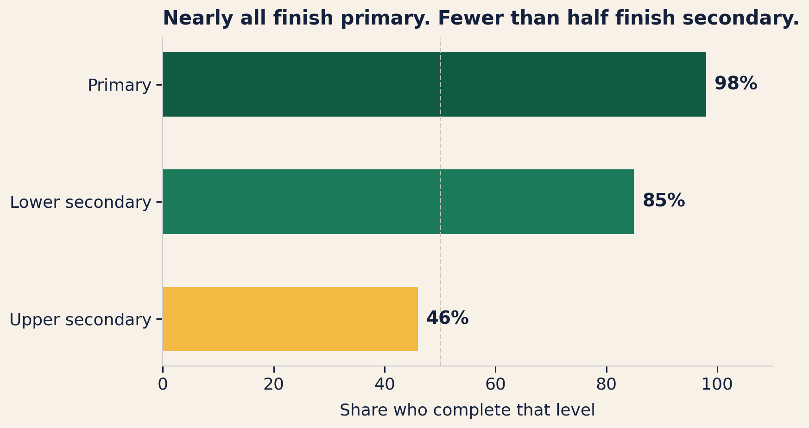

*Source:* Author chart from UNESCO IICBA (2025) Kenya education data brief estimates (midpoints of reported girl/boy rates). *Note:* Sector context only.

**Figure 2.** Official secondary enrolment rose to about **4.32 million by 2024** (latest year in KNBS *Economic Survey 2025*; full-year **2025** national enrolment is not in that release) - a larger in-school population means more students for whom fee shocks, health absence, and academic stall can still force exit.

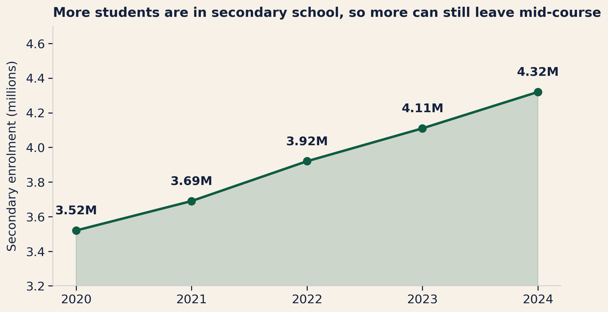

*Source:* Author chart from Kenya National Bureau of Statistics (2025), *Economic Survey 2025* (Popular Version), education - secondary enrolment (‘000), series **2020-2024**. *Note:* 2024 is provisional in KNBS tables; **2025 national total not released** in that survey. Enrolment growth ≠ completed retention. Sector context only.

**Why this brief, why now.** The same pressure that shows in Figures 1-2 also makes goodwill easy to misallocate: intention without a completed gift, and gifts that follow networks rather than measured risk or need type. The chapters that follow cover the venture response (company, team, strategy, pilot gates, evidence, architecture, and a Year-1 ask) without restating the full MVP catalogue from Section 1. Live demos: https://jesyldah.github.io/ElimuMatch/.

---

# 3. Company Overview

ElimuMatch is a fictional EdTech and social-impact organization built to force real design choices without impersonating a live ministry system. Its mission is easy to articulate and demanding to deliver: enable individuals and institutions to support secondary students and schools with the *right kind of help*, guided by retention risk rather than by chance encounters.

**Figure 3.** Three product layers: helpers stay simple; operations and analytics absorb complexity.

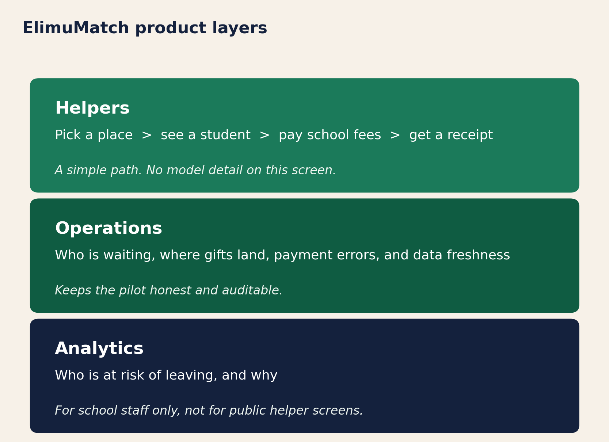

The organization thinks in three layers of experience. Helpers, in the MVP, choose a place and complete a fee gift that lands against verified term arrears. Analytics decide who needs what and why, using models and routing logic that never appear on the helper screen. Operations and foundation-facing views roll signals up to schools and counties, so larger programs can see where fee pressure, health burden, tutoring need, or digital gaps cluster. Geography in the proof of concept is national by design: the school catalog covers all forty-seven counties, with Day and Boarding options for each, while the student volume of the synthetic cohort remains a manageable one thousand records. That combination is intentional. National *design* is not the same as national *census volume*.

**Figure 3b.** From place to gift in four steps: the lunch-break path capital would pilot.

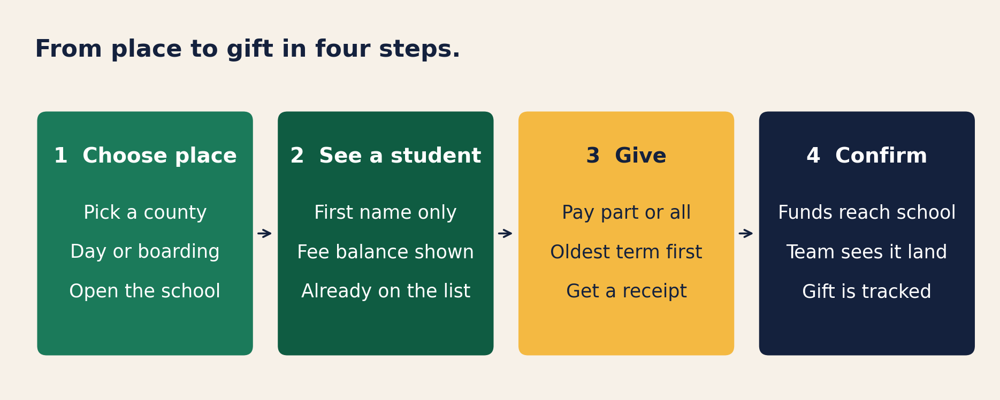

Helper fee gifts are pass-through capital to school fee accounts, not ElimuMatch revenue. The organization earns its keep by targeting well, settling cleanly, and showing that support reached priority cases. Tutoring and health markets, multi-tenant foundation portals, and mobile-money rails stay on the product roadmap; what ships today is the fee path in Figure 3b, the backbone that makes that roadmap investable rather than aspirational.

---

# 4. Team

## 4.1 Team name and organization

**Team name:** ElimuMatch  
**Organization:** ElimuMatch (fictional EdTech and social-impact venture; see Section 3)

## 4.2 Team composition and roles

| Member | Role | Contribution |
|---|---|---|
| **Jesyldah** | Founder, analytics lead, product designer, author | Synthetic data pipeline and retention model; SHAP, personas, and intervention matrix; Helper portal, Support Hub, and analytics dashboards; SQLite fee ledger and settlement rules; Kenya sector research; cost-benefit and this report |

ElimuMatch was built as a founder-led proof of concept. In practice that meant one person carried the synthetic data generation and model pipeline; Helper portal, Support Hub, and analytics interfaces; a fee ledger that respects real school billing patterns; Kenya-relevant research and open statistical context; and a business case written so figures remain transparent and auditable. Where a single founder covers multiple functions, the venture deliberately reuses shared artifacts: one school catalog for both data and portal, one intervention matrix for both operations and matching, one integrity language for both demos and this brief.

## 4.3 Skills concerns

A solo build cannot replicate a full product company on day one. The table below names the main gaps and how the proof of concept compensates for them until a pilot team forms.

| Skill gap | Why it matters | Mitigation in this PoC |
|---|---|---|
| **Legal / MOU and child safeguarding** | Live student data requires contracts and data-protection clauses | Pilot gate in Section 17; no live publish without MOU; design assumes external legal review before field use |
| **Production payments (M-Pesa / bank rails)** | Helpers need trustworthy settlement | Ledger rules proven in SQLite; live rails scoped to pilot Phase 3, not claimed as shipped |
| **Field ops and school liaison at scale** | Eight schools need onboarding and case review | Support Hub KPIs and human-review gate designed; 0.5 full-time-equivalent (FTE) liaison in Year-1 cost model |
| **Deep Kenya education policy / ministry integration** | National scale needs institutional relationships | National *design* (47-county catalog) with local *pilot* (8 schools); no ministry feed in scope |
| **Clinical / tutoring partner networks** | Non-fee channels need owners beyond analytics | Multi-channel routing on Support Hub; school/partner handoff, not helper marketplace, in MVP |
| **Solo bandwidth (build + evaluate + write)** | Quality risk across many surfaces | Fixed seed and reproducible repo; static HTML demos; shared dictionaries and one integrity language across artifacts |

These concerns do not invalidate the PoC. They define what must be hired, partnered, or gated before any claim beyond “ready for a cautious pilot.”

## 4.4 The product problem

The problem has two parts. First, helpers who care often never convert intention into a completed gift. Second, scarce support is easily misallocated when visibility and administrative process dominate over risk and need type. Theory provides language for student-side risk: Tinto’s (1993) emphasis on academic and social integration, and Adelman’s (2006) academic-momentum tradition that treats prior trajectory, including grade point average (GPA) trend and failure, as a material predictive signal. Applied to secondary education in Kenya, those traditions sit beside cash-flow shocks, commute friction, health-related absence, and weak protective support.

The solution is therefore hybrid. It is predictive where it ranks who is at risk of leaving, diagnostic where SHAP shows why, lightly prescriptive where an intervention matrix routes fee support versus school or partner actions, and descriptive where the Support Hub monitors gifts, concentration, fairness cadence, and data freshness. The outcome for an investor or partner is an interactive demonstration: open the Pages demo for the helper path, Support Hub, and analytics evidence; optionally run a local live ledger if settlement writing must be reviewed on SQLite rather than offline demo mode.

---

# 5. Strategic Analysis

If ElimuMatch were only another predictive model, it would fail. Its strategy starts from how the operating environment already works and how the venture’s capabilities meet that environment without overstating results.

### External analysis

Kenya’s system has improved access, yet equity and quality still lag, which means a platform that focuses only on enrolment volume misses the retention mission (Glennerster et al., 2011; Childress, 2015). Households often rely on volatile income, so a static snapshot of “poor versus rich” understates the shock that can push a student out mid-year (Gongera & Okoth, 2013). Schools navigating delayed external funding must absorb cash-flow uncertainty; latency in funding is itself operational risk (Adhola et al., 2025). Policy pressure for high transition between levels raises the cost of late discovery of attrition risk when schools absorb more students without matching support capacity (Otieno & Ochieng, 2020; RELI Africa, 2020). Helpers operate in a digital-payment environment with limited time for complex processes, and Kenya’s open-data and transparency agenda (Kenya National Bureau of Statistics, n.d.) makes opaque ranking politically and ethically weak.

Substitutes in the external landscape are familiar: manual case-finding by school staff; visibility-based giving and personal networks; annual bursary contests with high form friction; and generic crowdfunding without retention analytics or settlement discipline. None of these fail from lack of goodwill. They fail from uneven targeting, weak audit trails, and no shared language for *why* a student is at risk or *what type* of help they need.

### Internal analysis

ElimuMatch’s strategic fit is one analytics backbone serving three kinds of buyers, without forcing all three into the MVP user interface. Individuals want a fast, preference-based gift. Banks and CSR desks want ranked, explainable shortlists instead of opaque batches. Foundations want school-level assessments of need, not only one student at a time. The MVP proves the shared engine on the fee channel, while Support Hub surfaces already hint at the multi-channel future by showing non-fee lanes and school resource targets.

Internal strengths include a finished PoC surface (Helper portal, Support Hub, analytics, ledger), a three-layer data dictionary that separates risk from money, recall-aware model selection, SHAP and persona routing kept off the helper screen, and published integrity language on synthetic limits. Internal constraints are equally explicit: solo build bandwidth, no live partner data yet, no production authentication or payment rails, and fairness gaps in high-SES slices that require termly monitoring.

Relative to substitutes, the platform takes a disciplined view of current giving practice. Manual case-finding is slow and uneven. Visibility-based giving rewards the most visible case, not necessarily the highest retention risk. Annual application contests matter, but they are complementary to always-on preference giving and a ledger trail that can explain what happened after the gift, not only who won a form process. The map below places that choice for funders.

**Figure 4.** Perceptual map of substitutes versus ElimuMatch (illustrative positioning for CSR and impact funders).

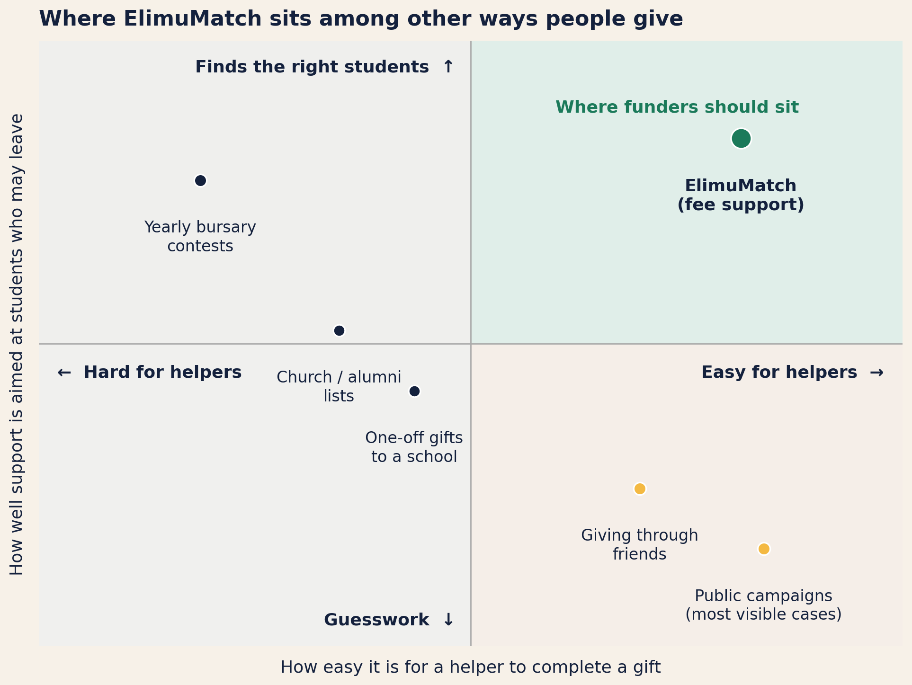

*Reading the map.* The upper-right is where impact capital should prefer platforms to sit: gifts that are simple for helpers *and* prioritized by explained retention risk and need type. Personal and campaign giving sit low on systematic targeting - generous, but uneven. Annual bursary contests can screen carefully, yet high form friction and seasonal cadence limit continuous preference gifts. ElimuMatch’s MVP claims only the fee lane of that upper-right zone; multi-channel school and partner routing remain on the Support Hub side. Seasonal bursaries and ElimuMatch are **complements**, not rivals: one is often a formal award process; the other is always-on matching with a settlement trail.

---

# 6. Analytics Opportunity

Where Section 5 places ElimuMatch among substitutes, this chapter names the **decision process** capital would fund: not novel prediction for its own sake, but allocation that an organization can defend when personal networks, proximity, or application timing would otherwise decide who gets help.

**Figure 5.** Defensible decision loop from risk score to monitored outcomes (also the product architecture spine: score → route → gift → monitor).

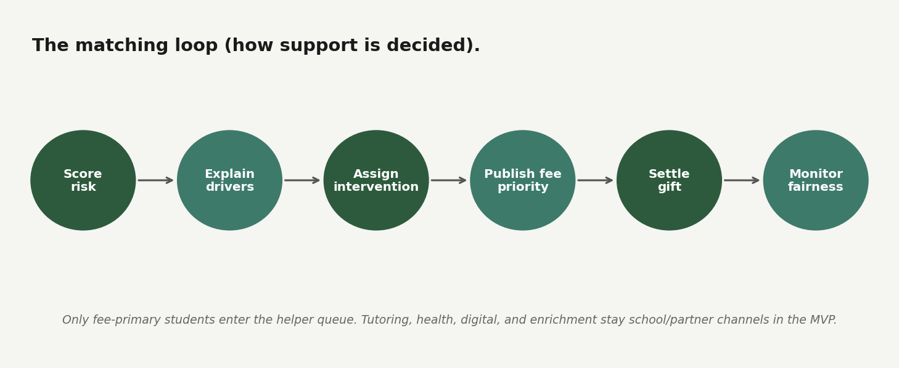

That loop creates concrete value for three audiences on one engine. Helpers complete geographic preference gifts without seeing model complexity. Operations watch concentration, term ageing, and scoring freshness. Institutions can later reuse the same ranking for shortlists and school targeting. Predictor families follow established student-performance and dropout literature (Cortez & Silva, 2008; Realinho et al., 2022), adapted to Kenyan secondary constraints and to a three-layer dictionary that keeps fee money in the ledger rather than as the sole model story. Sections 11-14 present the evidence behind each step; Section 15 shows the shipped product path.

---

# 7. Rationale

**Why build now.** Retention pressure and fee volatility are documented (Section 2); tooling and browser demos are mature enough to prove matching without claiming production payment rails; and an end-to-end fee path with transparent assumptions yields a Year-1 case worth defending (Section 16).

**Why build this way.** Theory already stated in Section 4.4 (Tinto, 1993; Adelman, 2006) justifies belonging, academic trajectory, and barriers, not dropout as random noise. Ethics require no orphan-status predictors, no oversold synthetic metrics, and human review before any live student list. Scope discipline is part of the case: the product vision stays on the horizon; success for this raise is a finished MVP with known limits and a clear pilot plan (Sections 9-10).

---

# 8. Stakeholder and Requirement Analysis

Every design choice in ElimuMatch is really a choice about *who is allowed to see what* - the same product split shown in Figure 3, restated as stakeholder requirements rather than another diagram.

### Key stakeholder questions

Eight questions that shaped requirements and product boundaries:

| # | Stakeholder | Question | Requirement implied |
|---|---|---|---|
| 1 | **Helper (individual donor)** | “Can I support a student in my county without administrative burden or personal connections at the school?” | County and school-type filters; anonymized student card; partial or full gift in minutes; receipt |
| 2 | **Helper** | “Will my contribution settle verified school fees with a clear audit trail?” | Term arrears visible; settlement against verified balances; ledger authority; overpay and stale-pay rejected |
| 3 | **School bursar / admin** | “Can we reconcile gifts to our fee books without double-counting or creating unauthorized credit?” | Oldest-term-first allocation; category order; transactional locks; audit trail in Support Hub |
| 4 | **ElimuMatch operations** | “Who is in the fee queue, and are we concentrating gifts on too few schools?” | Ranked queue; concentration and fairness panels; human review before first live publish |
| 5 | **Analytics / leadership** | “Why is this student prioritized, and can we defend the model to a board?” | SHAP and personas on analytics surface; documented selection rule; SES fairness diagnostics |
| 6 | **Student and family** | “Will being ‘high risk’ shame my child or block enrolment?” | Risk scores for *support allocation only*; no public risk labels on helper UI; orphan status excluded from model |
| 7 | **CSR / foundation (future)** | “Can we target schools or cohorts with explainable shortlists, not ad hoc lists?” | School-level rollups on Support Hub; intervention matrix; design for institutional buyers without full portal in MVP |
| 8 | **Partner (tutoring / health)** | “If the need is not fees, where does the case go?” | Non-fee lanes on Support Hub with handoff status; school/partner ownership, not unfinished helper marketplaces |

The helper is a time-poor adult who may care about a particular county or school type. Their requirement is speed, clarity, and dignity: select place, see an anonymized student with arrears by term, give a partial or full amount, receive a receipt. They are not a data scientist. Showing them SHAP beeswarms or a thirty-seven-feature matrix would be both confusing and operationally dangerous. Schools and ElimuMatch operations want the opposite density: investigation queues, pilot criteria, concentration risk, rejected settlements, and data freshness. Analysts and leadership want to know whether the ranking engine earns trust. Students and families want support without stigma; anonymized display and careful feature ethics matter more to them than dashboard aesthetics. Future banks, CSR desks, and foundations care about fair shortlists and school-level targeting, which the design anticipates even when the MVP interface does not yet fully serve those buyers.

Requirements fall into several voices. Functionally, the system must predict retention risk, explain priority, assign interventions, settle fee gifts against term arrears, and expose operational health. Governance demands human-in-the-loop review before any real list is made public. Ethical requirements bar orphan flags as model inputs, insist on MOU protections for minors in any live pilot, and forbid presenting synthetic AUC as national truth. Technically, the ledger is authoritative over whatever a helper’s screen once displayed. Constraints for the current proof of concept are explicit: no production authentication, no live M-Pesa rails, and no full tutoring or health marketplaces masquerading as finished deliverables.

### Ethics, privacy, bias, and stakeholder impact

ElimuMatch is meant to allocate *support*, never to exclude, shame, or deny enrolment based on a risk score. That purpose constraint is non-negotiable. Practical safeguards include:

| Risk | Stakeholder impact | Safeguard in design |
|---|---|---|
| **Protected-attribute proxies** (e.g. orphan status as a convenient “need” flag) | Stigma, bias, unfair channeling | Orphan status **excluded** from model features; need expressed via SES and behavioral proxies |
| **Stigma if helpers see “high risk” labels** | Harm to student dignity | Helper UI is **anonymized** and action-framed; SHAP/model detail stays in analytics/ops |
| **Minors’ data and misuse** | Legal and moral harm | Live pilot requires **MOU**, data-protection clauses, child safeguarding, and **human review** before publish |
| **Synthetic metrics presented as national performance** | Misled capital and policy | Report and demos state **PoC / synthetic** limits; scale gated on partner pilot KPIs |
| **Unequal ranking quality by SES** | High-SES groups hard to separate | Fairness by SES quintile reported; termly fairness reviews required |
| **School gaming high-risk lists for funds** | Distorted incentives | Ops concentration monitoring; review queues; settlement only against verified arrears |
| **Settlement error as trust collapse** | Donor and school harm | No overpay, no stale pay, oldest-term-first, ledger authority over screen cache |

These controls do not remove residual model risk. They define a duty of care appropriate to education and CSR capital: explainable, reviewable, and limited in claim.

---

# 9. Success Criteria

Success has two horizons, and they must not be confused.

For *this proof of concept and investor brief*, success means a leakage-safe model with a documented business selection rule; a fee path and ledger that work; demos that open without friction; and integrity language that makes synthetic data and cost assumptions unmistakable. One public Pages link and a reproducible repository are part of that definition, because a venture that cannot be inspected is only a claim.

For a *live pilot after this brief*, success is operational and measured. The organization should raise fee-queue gift coverage so that more priority students actually receive at least one gift. Scoring and fairness checks by SES and gender should run on a fixed cadence rather than ad hoc review. Settlement must stay clean: no unallocated money, no overpayments that create unauthorized credit balances. Aged Term-1 arrears pressure should decline as gifts are allocated with oldest-term logic. Finally, next-term retention for helped students versus matched peers must be measured on real outcomes. The Support Hub can already display method for those ideas; only a live pilot can convert the retention comparison from illustrative method into measured result. Synthetic labels should not be interpreted as evidence of causal impact.

### Pilot success metrics (targets, not synthetic claims)

| Metric | Why it matters | PoC baseline (synthetic / design) | Pilot Year-1 target | Owner |
|---|---|---|---|---|
| **Fee-queue gift coverage** | Priority students should actually receive support, not only a rank | Queue design live; gift volume illustrative | ≥ **40%** of fee-primary queue receives ≥1 meaningful gift | Ops / school liaison |
| **Settlement integrity** | Trust erodes if money is misallocated | Ledger enforces reject on overpay / stale | **0** successful overpays; under **2%** rejected gifts after helper fix | Platform + finance ops |
| **Oldest-term clearance** | Fee pressure ages; Term-1 should not rot | Oldest-term-first rule engineered | Share of gifts applying to Term-1 first ≥ **70%** when Term-1 arrears exist | Platform |
| **Scoring freshness** | Stale risk scores mis-route help | Periodic scoring concept | Rescore within **14 days** of each term start (or after major MIS extract) | Analytics lead |
| **Fairness cadence** | Ranking must not degrade for subgroups without detection | SES AUC gap diagnosed on synthetic holdout | Document gender + SES fairness review **each term**; escalate if AUC gap widens without cause | Analytics + governance |
| **Next-term retention (helped vs peers)** | Proves impact beyond model metrics alone | Not measurable on synthetic “gifts” | Define matched peers; report retention **delta** (no causal claim without design) | Ops + research partner |
| **Human review gate** | Minors and false priority | Required in design; not live production auth | **100%** public queue cases reviewed before first live publish | Ops case review |
| **Platform budget adherence** | Capital discipline | Illustrative stack ≈ KES 2.0M | Year-1 platform spend within **±10%** of approved budget (ex-bursary) | Founder / finance |

Targets are directional pilot commitments. They are intentionally more ambitious on process integrity than on claim of causal dropout prevention, because process is what the organization can control in Year 1.

---

# 10. Scope and Schedule of Deliverables

### Feasibility analysis

The proof of concept is feasible as a first build because scope was narrowed to one complete channel (fee gifts) on synthetic data, with static browser demos that do not require production infrastructure. Technical feasibility is demonstrated: the model trains and validates on a fixed-seed cohort; the ledger enforces settlement rules; and all product surfaces open from a single GitHub Pages URL. Operational feasibility for a *live* pilot depends on partner schools, MOUs, and Tier-1 administrative fields schools already hold; those are gated as post-PoC work, not assumed complete. Financial feasibility is argued in Section 16: platform cost near KES 2.0M for an eight-school Year-1 pilot, with base-case benefits exceeding cost under stated assumptions. The main feasibility risk is data access for minors; the mitigation is synthetic PoC now, soft pilot with human review before any public list.

### Scope

The MVP scope is intentionally a finished slice of a larger story. In scope are the documented synthetic data generating process and its calibration narrative; the feature dictionary and thirty-seven-column modeling matrix; modeling, SHAP, personas, and the intervention matrix; the SQLite fee ledger; the helper, ops, analytics, and schema HTML experiences; GitHub Pages as the share surface; Year-1 cost-benefit and social-value framing; and this report. Out of scope, with equal intention, are live ministry feeds, production authentication, real mobile-money settlement, full non-fee helper marketplaces, multi-tenant national portals, and claims of causal retention lift from randomized live trials.

### Deliverables and schedule

| Phase | Period (illustrative) | Deliverables | Status |
|---|---|---|---|
| **Research and framing** | Months 1-2 | Kenya literature review; stakeholder and ethics framing; product-layer design | Complete |
| **Data and modeling** | Months 2-4 | Synthetic cohort (`synthetic_data_v2.py`); exploratory data analysis (EDA); preprocessing; Logistic Regression model; SHAP; personas; intervention matrix | Complete |
| **PoC build** | Months 4-6 | Helper portal; Support Hub; analytics dashboard; SQLite ledger; GitHub Pages site | Complete |
| **Evaluation and business case** | Months 6-7 | Cost-benefit analysis; pilot KPIs; scale-up recommendations; this report | Complete |
| **Partner gate (post-PoC)** | Month 8+ | School MOUs; data-protection review; soft pilot (score + review, no public list) | Planned |
| **Live fee pilot** | Year 1 post-funding | M-Pesa/bank rails; weekly settlement monitoring; termly fairness pack | Planned |
| **Expansion decision** | End of Year 1 | Go/no-go on additional schools/channels per Section 17 gates | Planned |

**Figure 6.** Scale only after earned gates - PoC → MOU → pilot → expansion (this gate sequence is the scale narrative for the rest of the report).

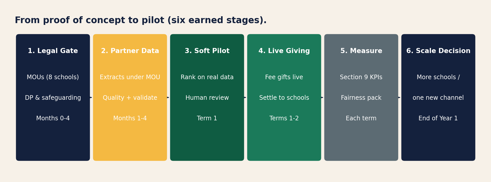

Work moved through a professional engagement arc: research grounding (Kenyan literature, open data context, education ML benchmarks), data and modeling, MVP proof of concept build, then evaluation, cost analysis, and this investor-facing brief. Later phases lean first into partner school MOUs and administrative data, then into one additional channel, then (much later) payment rails and broader foundation tooling. This report does not present those later phases as if they were already delivered.

---

# 11. Data Understanding

After requirements, success metrics, and scope (Sections 8-10), the evidence base comes next: what data the proof of concept uses, why it is synthetic, and how money and risk stay in separate books.

## Why the cohort is synthetic

Partner student records were unavailable in development for reasons any serious education venture should respect: minors’ privacy, data-sharing agreements, and partnership timelines that do not pause for a product build. The project therefore built a fully synthetic cohort of one thousand students through `synthetic_data_v2.py` (seed 2026) into `elimu_match_data_v4.csv`. “Synthetic” here does not mean unstructured or arbitrary. The data generating process encodes SES gradients, conditional barriers, academic linkage, health-driven absences, intentional missingness on survey-like fields, and a retention outcome near eighty-six percent retained, consistent with a setting where most students stay but attrition remains serious for targeting. Distributions were oriented using Kenyan structural context from open statistical sources and sector reporting (RELI Africa, 2020; Kenya National Bureau of Statistics, 2025): household-size order of magnitude near national averages, retention and transition pressure as orientation for prevalence, commute distances that reflect rural and peri-urban friction, and poverty and nutrition as reasons certain features matter, not as copied microdata from a single school.

These limitations are material to data understanding and should be stated clearly. Relationships in synthetic data are cleaner than in operational school ledgers and can inflate model separability. Unobserved shocks such as family relocation, school closure, or sudden fee crises are absent. Support-program variables in the generator can co-move with SES, which creates endogeneity risk if coefficients are interpreted as pure causal effects. Median later imputation is a PoC convenience, not a production missing-data policy. The model has not been externally validated on partner administrative records. Results belong to the parameterization of this cohort and should not be treated as portable truth across every region and school type. Ethics still hold: risk scores are for *support allocation*, never for exclusion, shaming, or denying enrolment. Fuller discussion lives in `DATA_AND_LIMITATIONS.md`.

| **Assumption / limitation** | **Mitigation for the organization** |
|---|---|
| Synthetic relationships can inflate separability | Treat metrics as design proof; retrain and re-threshold on school extracts before public publish |
| Unobserved shocks (closure, relocation, sudden fee crisis) absent | Human review + school liaison override; never fully automate enrolment decisions |
| Support variables co-move with SES (endogeneity) | Do not sell coefficients as pure causal effects; use ranking for prioritization, not blame |
| Survey fields often missing | Missingness indicators in model; Tier-3 surveys only for high-risk slice |
| No external validation yet | Soft pilot (internal scoring first); gate public lists on partner holdout performance |
| National catalog ≠ national volume | Start with eight schools; expand only after KPI gates |
| Median imputation is a PoC interim method | Production: school-informed missing-data policy and termly audit |

## A three-layer dictionary: separating money and risk

The product layers in Figure 3 already separate what helpers see from what staff see. Under that separation, the *data* design deliberately keeps three books of record apart, so fee balances and retention risk are not treated as the same construct. **Layer 1** trains retention risk from demographics, household strain and income shocks, access barriers, academic momentum, health and absences, belonging, and protective support - not from fee arrears alone. **Layer 2** is what helpers filter on: county, school, and preference-oriented signals that help a giver choose place and type. **Layer 3** is the ledger: term fee arrears, fee-support status, last payment, human review flags - the authoritative books operations and settlement use. Fee arrears deliberately stay operational rather than becoming the model’s only definition of poverty. Orphan status is not allowed as a model feature, out of concern for bias and dignity; need is expressed through socioeconomic and behavioral proxies instead. The data generating process’s latent risk oracle and post-outcome dropout reasons are never trained as predictors. Catch-up status, which sits near-deterministic with failures, is dropped for leakage and redundancy hygiene in preprocessing even when design notes discuss it as a conceptual sensitivity feature.

This separation is how ElimuMatch avoids two weak narratives: reducing dropout risk to unpaid balances alone, and using protected status as a convenient predictive flag. At gift time, a helper still sees arrears, because arrears are real school books. The ranking of who reaches the fee queue comes from risk and intervention matrix logic built on Layer 1, not from a model that merely predicts unpaid balances.

### Data dictionary snapshot (not the full field list)

| Field / family | Layer | Role in the product | In retention model? | Pilot collection tier |
|---|---|---|---|---|
| Age at enrolment, gender | 1 | Demographics & fairness slice | Yes (with care) | Tier 1 (registers) |
| SES / resource dilution, cash-flow volatility | 1 | Household economic pressure | Yes | Tier 1-2 (proxy or short form) |
| Commute barrier, digital access, school feeding | 1 | Access & barriers | Yes | Tier 2 (school/ward map) |
| GPA trend, failed subjects, STEM (science, technology, engineering, mathematics) signal | 1 | Academic momentum | Yes | Tier 1 (marks register) |
| Chronic health risk, health-related absences | 1 | Health & attendance pressure | Yes | Tier 1 absences; health note as available |
| Social integration, psychosocial support access | 1 | Belonging & buffers | Yes (missingness-aware) | Tier 3 (high-risk slice / survey) |
| County, school name / type (Day, Boarding) | 2 | Helper place filters | No (UI filter only) | Tier 1 (catalog) |
| Term fee arrears by category, gifts, allocations | 3 | Settlement books helpers and ops use | No (ops only) | Tier 1 (bursar / school books) |
| Human review flag, last payment timestamp | 3 | Trust & publish gate | No | Tier 1 (ops workflow) |

*How to read.* Layer 1 ranks who is at risk and why. Layer 2 is how helpers choose *place*. Layer 3 settles money against real arrears (and is not used as model input). Sixteen core Layer-1 predictors expand to thirty-seven modeling columns after engineering (indices, interactions, missingness flags). Orphan status, the synthetic risk oracle, post-outcome dropout reason, and catch-up status are omitted from this table because they are excluded or dropped by design (dignity, leakage, or redundancy). Full field documentation lives in `Data dic.docx` and exploration exports under `tableau_exports/data_dictionary.csv`; the database surface is browseable via `db/schema_dashboard.html`.

## Dynamic pressure and real-world collection realism

Retention is not only a fixed “poor household” label. Cash-flow volatility, learning gaps that require catch-up, and psychosocial support access are framed as retention-sensitivity ideas: shocks and buffers that change mid-year. In a live school, collecting every idealized field for every child is not operationally realistic. A tiered acquisition strategy is therefore part of the data plan. Tier 1 administrative data (age, gender, marks and failures, GPA trend, absences) is usually already in registers or an Education Management Information System (EMIS). Tier 2 institutional mapping (commute proxies, school feeding, school environment) can often be assigned once by school or ward. Tier 3 survey fields (precise income dynamics, psychosocial access, home digital access) are expensive and should be reserved for the top risk slice, or replaced with geospatial and asset-based proxies. That is how the venture stays ambitious in design while remaining realistic about staff capacity.

---

# 12. Data Preparation

Preparation is where the pipeline either enforces leakage controls or fails them. The pipeline excludes student identifiers as features, treats retention as the sole target, drops the oracle retention risk score used only to generate outcomes, drops post-outcome dropout reason, and drops academic catch-up status as redundant with failure counts. Fee payment fields remain off the modeling matrix. What remains is expanded deliberately: sixteen core predictors become thirty-seven modeling columns after engineering indices, interactions, and five missingness indicators that respect the fact that survey-like fields intentionally go missing (slightly more often at lower SES). The original CSV is therefore not “a 37-column dataset”; engineering creates the matrix the model sees.

**Figure 7.** Engineered-feature correlations after preparation (collinearity is expected and intentional among indices).

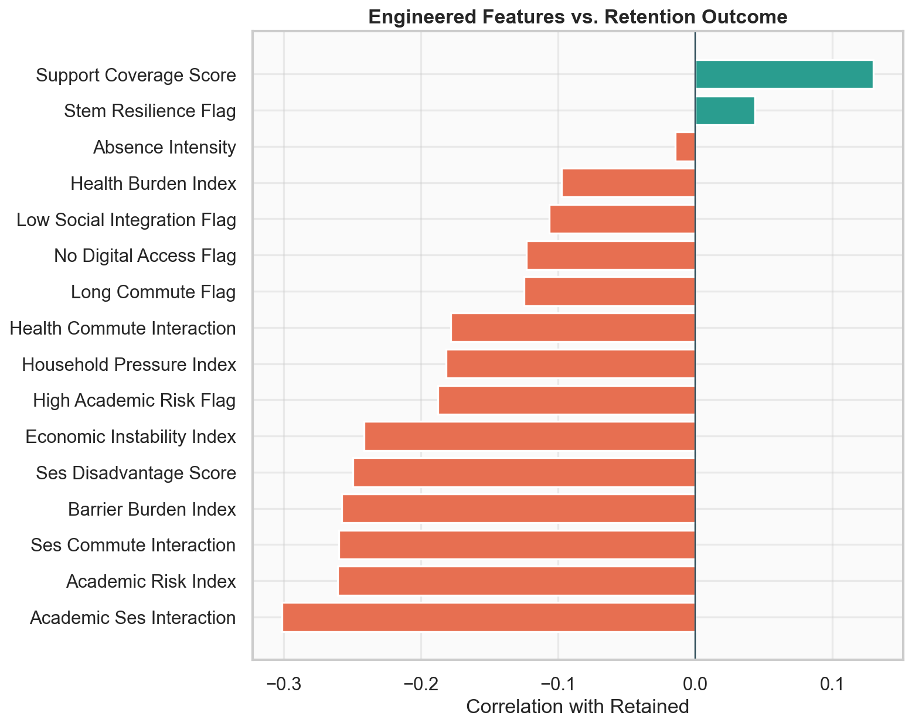

Training hygiene follows ordinary but non-negotiable practice. The split is stratified seventy-five / twenty-five. Median imputation and scaling are fit on train only. Class weighting and evaluation prioritize recall for students who drop out, because the business cost of missing an at-risk student is higher than headline accuracy on a mostly retained population.

A second preparation track exists for operations. Modeling can live in CSV; gifts cannot. The SQLite proof of concept, rebuilt through `python db/init_db.py`, materializes schools, students, term fees by category, payments, allocations, risk snapshots, and a refresh log. Freshness is defined by process, not assumed continuous: fee balances update when gifts post and when termly school syncs arrive; risk scores are periodic after scoring runs; model retrain is termly when outcomes lag; the modeling cohort itself remains illustrative synthetic data, not a Ministry of Education feed.

---

# 13. Exploratory Data Analysis

Exploratory results from the synthetic cohort shape product design: **what the data show (finding)** and **what the organization should do (action)**, ahead of formal methods and modeling.

Exploratory analysis explains why later modeling choices are rational. Roughly fourteen percent of the synthetic cohort drops out, which means a majority-class guess can look accurate while remaining useless for intervention.

**Figure 8.** Lower socioeconomic status coincides with lower retention - so fee and multi-barrier support must prioritize the bottom of the SES ladder.

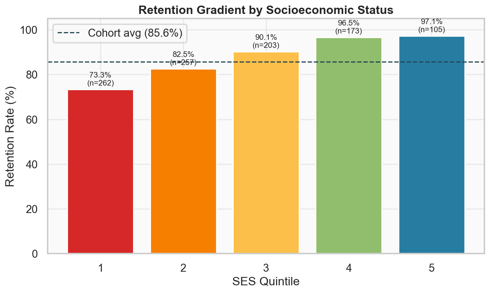

*So what?* **Finding:** retention falls across lower SES quintiles. **Action:** treat fee-support targeting as an equity instrument, not only an accuracy exercise; expect weaker model separation among high-SES students where nearly everyone stays (see fairness section).

Health burden, absences, academic failure, and economic volatility tend to move together, which is why personas later feel like recognizable groups rather than arbitrary clusters.

**Figure 9.** Health and economic pressure tend to appear together; interventions cannot be “fees only” for every high-risk student.

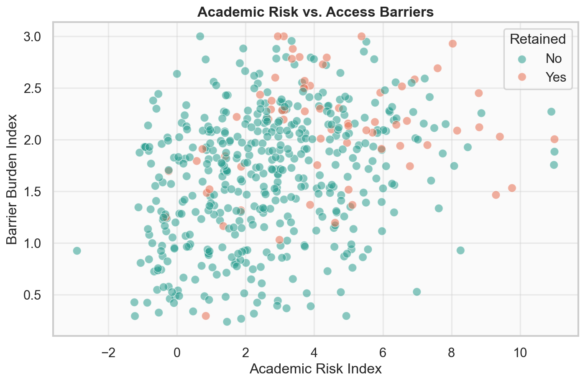

*So what?* **Finding:** risk dimensions cluster rather than acting independently. **Action:** keep multi-channel routing (health, tutoring, digital) in ops design even when the MVP helper path is fee-only.

Missingness is material enough on survey fields that the pipeline cannot assume every row is complete.

**Figure 10.** Survey fields go missing more often at lower SES - imputation and missingness flags are product requirements, not polish.

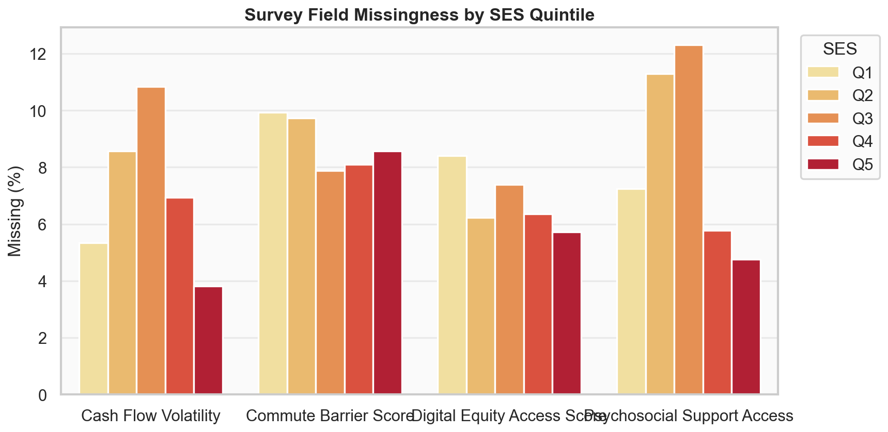

*So what?* **Finding:** missingness is structured, not random noise. **Action:** pilot data collection should start with Tier-1 registers and missingness-aware features, not a complete survey of every child.

On the operational side of the synthetic ledger, the fee-support primary queue is on the order of a few hundred students out of one thousand, with a smaller high-risk-plus-arrears investigation set. Term ageing, gift concentration, and settlement attempts become visible as organizational risks, not only as row counts. Those operational numbers are illustrative ledger statistics for a proof of concept. They are not ministry publications. Supporting visuals are on the analytics dashboard at https://jesyldah.github.io/ElimuMatch/.

---

# 14. Methods and Frameworks

Retention risk is scored and routed as follows. The business rule is concise: **rank with recall-aware models, explain with SHAP on the analytics surface, and settle fee gifts against verified balances.**

### Overall approach

The project follows a Cross-Industry Standard Process for Data Mining (CRISP-DM) sequence adapted to a product build: business understanding of Kenya’s retention and equity problem; data understanding of synthetic design and dictionary layers; preparation against leakage; modeling under a business selection rule; evaluation through metrics, SHAP, fairness, and cost narrative; and deployment as demos plus a ledger path rather than a claim that production infrastructure is already complete.

### Tools and technologies

| Layer | Tools | Role |
|---|---|---|
| **Data generation** | Python (`synthetic_data_v2.py`), pandas | Reproducible cohort (seed 2026, n = 1,000) |
| **Modeling & EDA** | scikit-learn, SHAP, matplotlib/seaborn | Train/validate LR; explain drivers; fairness slices |
| **Personas & routing** | K-Means, custom intervention matrix | Need-type labels and fee-queue eligibility |
| **Ledger & ops data** | SQLite (`db/init_db.py`), Python builders | Term fees, gifts, allocations, freshness API |
| **Product surfaces** | Static HTML (`build_*.py` generators), GitHub Pages | Helper portal, Support Hub, analytics, schema browser |
| **Optional UI** | Streamlit (`streamlit_app.py`) | Experimental parity; HTML is primary share path |
| **Reproducibility** | Git, fixed seeds, documented pipelines | Examiner and partner can rerun without oral handoff |

### Alignment with project goals

Each method choice maps to a project goal from Sections 1 and 9:

| Goal | Method alignment |
|---|---|
| Rank retention risk with business recall | LR selected on AUC-tie → higher dropout recall rule |
| Explain priority to staff, not helpers | SHAP and personas on analytics/ops only |
| Route fee vs non-fee needs | Intervention matrix; fee-primary → helper queue |
| Settle gifts with integrity | Oldest-term-first ledger; reject overpay and stale balances |
| Monitor fairness and ops health | Support Hub KPIs; SES quintile diagnostics; concentration panels |
| Stay honest on synthetic limits | Metrics labeled PoC; pilot gates before national claims |

Predictive modeling asks a simple question that is hard to answer well: will this student remain enrolled? Training aims to rank students so fee support and other channels can prioritize. Feature families were informed by prior education machine learning (including Cortez & Silva’s student performance tradition and later dropout and success tasks such as Realinho et al., 2022) and by Kenya-focused reading on volatility and access. Candidate models included a majority baseline, Logistic Regression, Random Forest, and Histogram Gradient Boosting. The selection rule was deliberate. Highest test AUC wins when the field is clear; if models sit within about 0.015 AUC of each other, higher dropout recall wins, because an intervention organization is hurt more by missing a student who leaves than by a slightly stronger ranking curve.

### Error trade-offs (why recall is the business metric)

| Error type | What happens | Business cost |
|---|---|---|
| **False negative** (miss a student who drops) | No priority, no gift path, silent exit | High: retention failure the system was built to prevent |
| **False positive** (flag retained student) | Review time and possible gift competition | Medium: staff load and scarce gift budget if unchecked |
| **Majority baseline “accuracy”** | Predict everyone retained | Misleading headline metric; zero operational value |

Thresholds in a live pilot should be set with ops capacity (how many cases human review can clear per week), not only maximum AUC.

**Figure 11.** When AUC is nearly tied, choose Logistic Regression - it catches roughly twice as many dropouts as gradient boosting on this holdout.

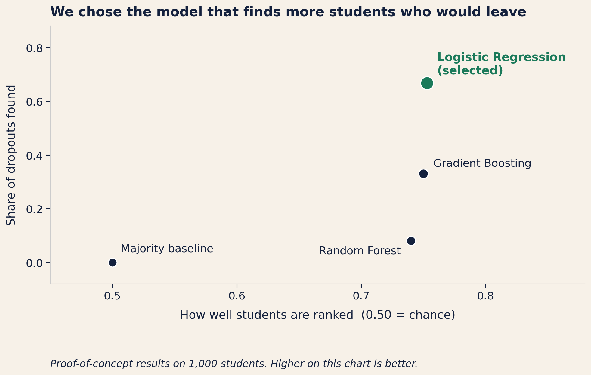

*So what?* **Finding:** LR dropout recall ≈ 0.67 vs ≈ 0.33 for boosting at similar AUC. **Action:** deploy LR for ranking; keep trees as challengers for termly re-bake.

Under that rule, Logistic Regression was selected. On the holdout set it posts an AUC near 0.753 and dropout recall near 0.667. Gradient Boosting edges AUC slightly higher but catches only about a third of dropouts. Random Forest looks accurate because it hugs the retained majority and almost ignores dropouts. The majority baseline shows chance AUC at 0.5.

**Figure 12.** Holdout panel: accuracy alone would have wrongly crowned models that ignore dropouts.

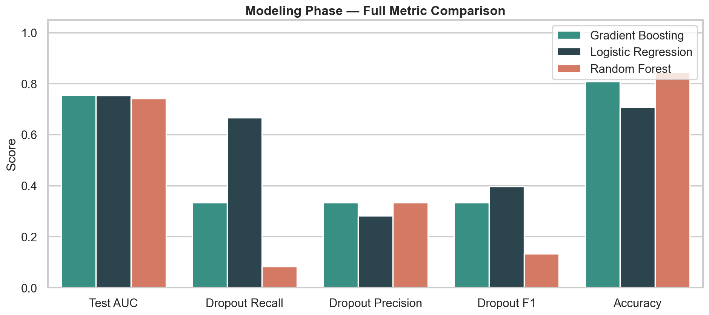

**Figure 13.** ROC curves confirm discriminative ability - but AUC is only half of the selection rule.

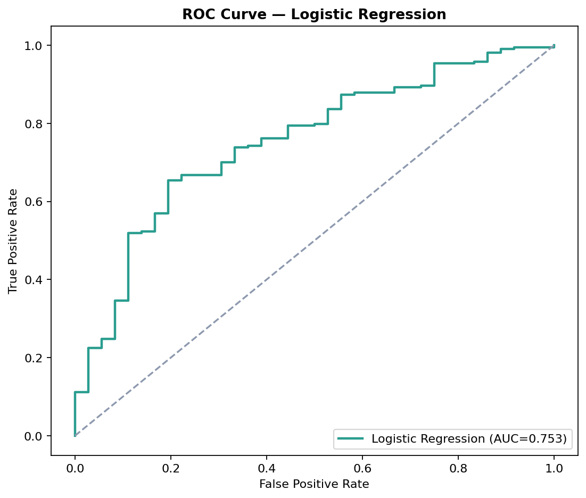

Fairness by SES quintile shows weaker separation where retention is already nearly universal. Class imbalance is not a footnote; it is the reason accuracy was never allowed to become the primary metric.

**Figure 14.** Ranking is weaker in high-SES slices; monitor fairness termly, or capital will miss students who still drop out.

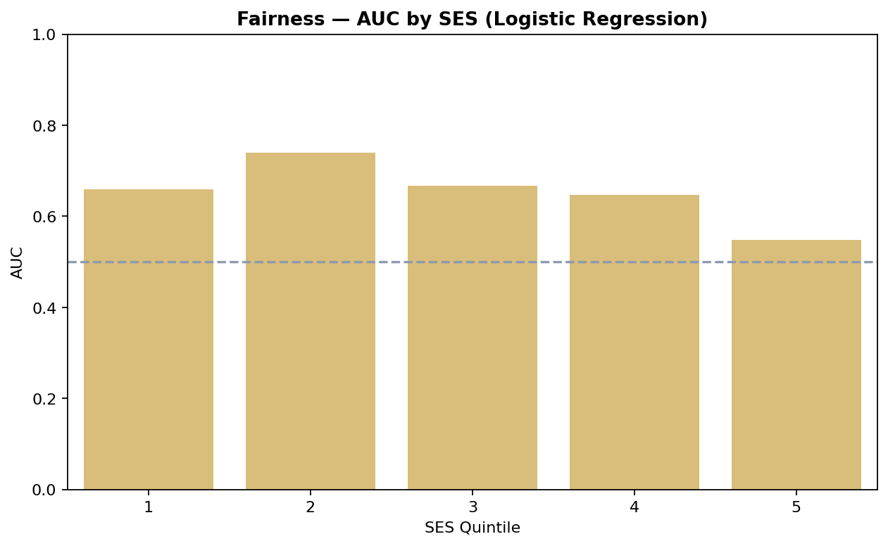

*So what?* **Finding:** AUC falls where almost everyone stays. **Action:** report stratified metrics; do not interpret a single national AUC as fair performance.

Explainability uses SHAP (Lundberg & Lee, 2017) so that positive contributions align with higher dropout risk in stakeholder conversation. Global importance surfaces health risk and burden, academic interactions with SES, belonging and barriers, absences, and cash-flow volatility, consistent with evidence linking student health to learning and retention risk (Basch, 2011). Those explanations stay on the analytics surface. Helpers receive a concise, action-oriented reason, not a technical model briefing.

**Figure 15.** Health, academic×SES, and barriers lead global SHAP importance - so fee help alone cannot be the full theory of change.

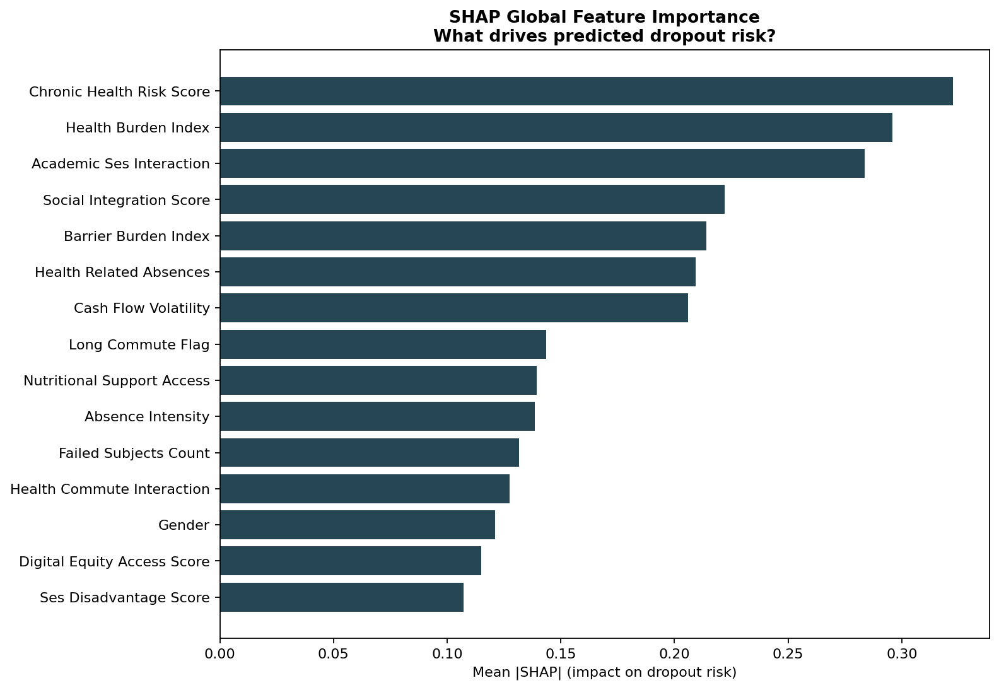

*So what?* **Finding:** chronic health and multi-barrier signals dominate. **Action:** surface non-fee needs on ops/school channels; keep SHAP off the helper screen.

**Figure 16.** SHAP beeswarm: driver effects vary across students - priority is local, not one-size-fits-all.

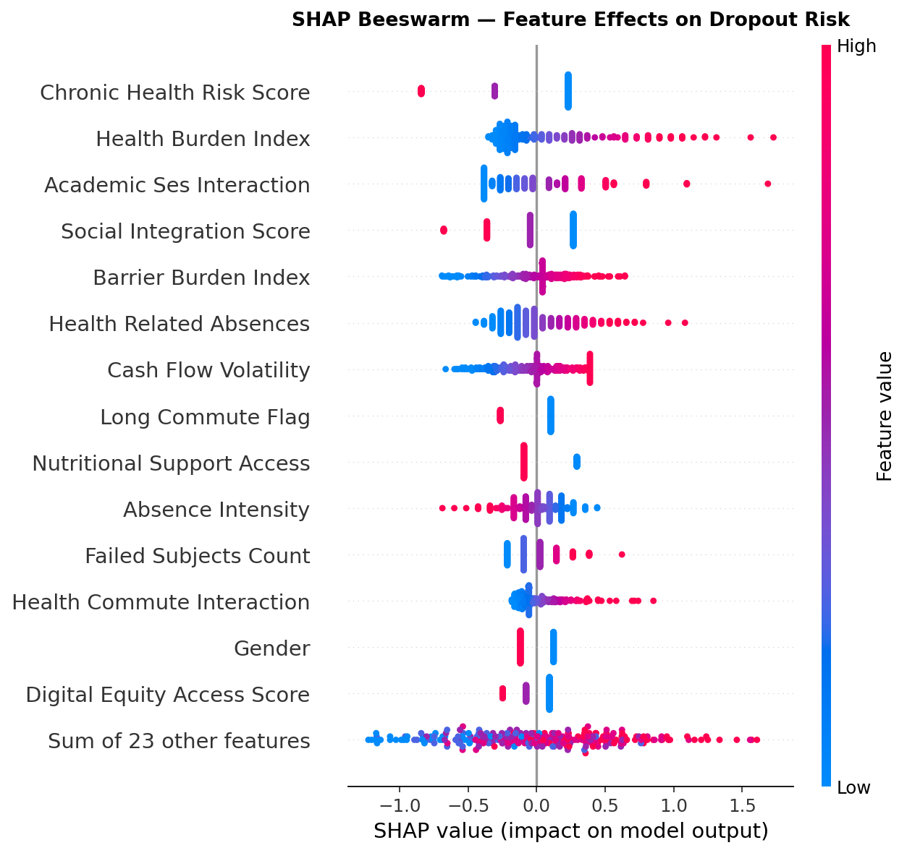

Beyond ranking, K-Means on behavioral features (not on the retention label) produces risk personas that suggest *what kind* of pressure a student faces: academic struggle, health constraint, or relative stability.

**Figure 17.** Personas separate *kinds* of need - routing quality depends on this label as much as on risk score.

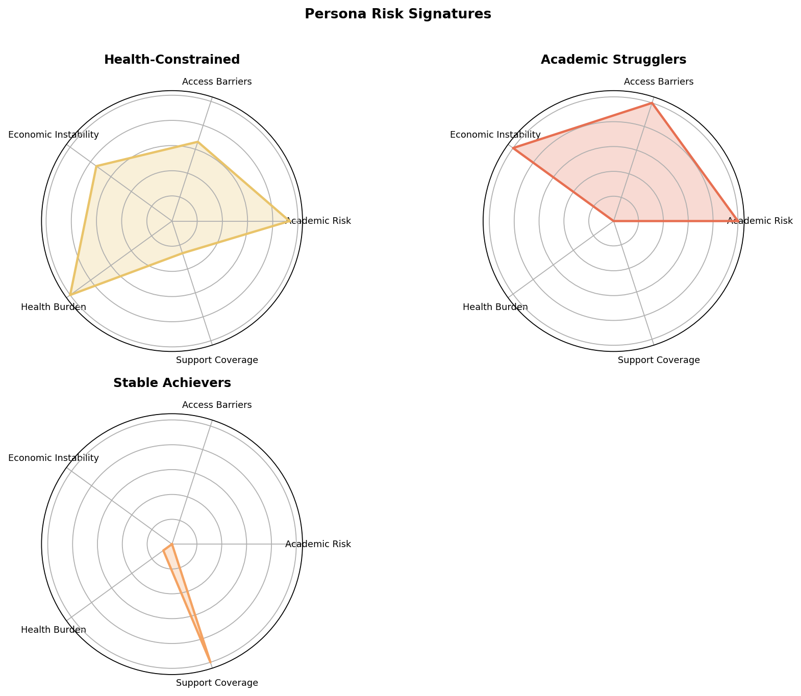

An intervention matrix then scores actions from not-indicated to priority by combining persona policy, signal boosts, and dropout risk. Only students whose primary intervention is school fee support enter the Helper portal queue. Other primaries remain design and ops objects for school and partner channels, which is an intentional product decision: the MVP proves one complete helper marketplace rather than four unfinished ones.

**Figure 18.** Intervention intensity differs by need type - MVP exposes only the fee-primary lane to helpers.

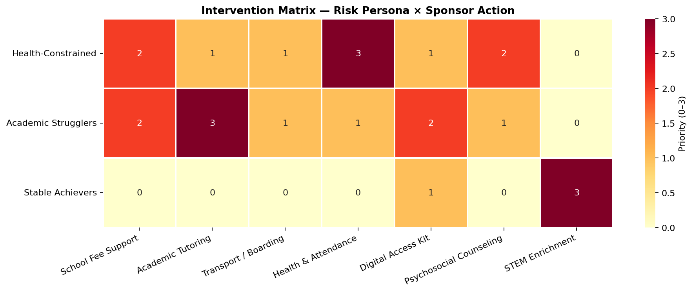

**Figure 19.** A few hundred fee-primary cases form a manageable queue out of one thousand - scope is pilot-sized by construction.

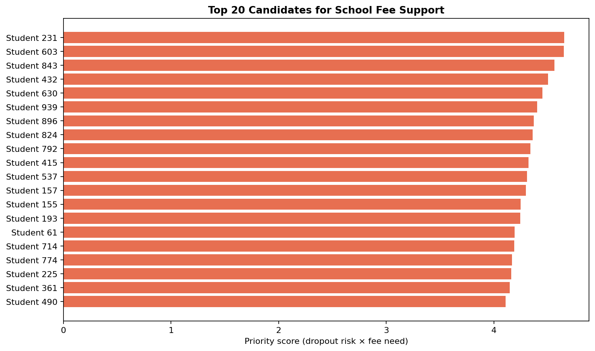

Finally, settlement algorithms are treated as method, not optional plumbing. Oldest selected term first, category order within a term, transactional locks, overpayment rejection, and stale-balance rejection matter because trust erodes when money lands incorrectly. A ranking model without clean settlement is an incomplete product.

---

# 15. Solution Architecture

This chapter implements the decision loop from Figure 5 as shipped product: score, route, gift, and monitor across the Helper portal, Support Hub, analytics, and fee ledger.

A calibrated synthetic student record (later, a Tier-1 school extract) enters feature engineering and scoring. The model and personas feed an intervention matrix. Non-fee recommendations surface for school and partner attention. Fee-priority students appear on the Helper portal that filters by county and school type, including both Day and Boarding schools in every county. The helper chooses a student, selects term arrears, enters an amount, and pays. In a live local demo the ledger reallocates immediately; on GitHub Pages the gift is a personal offline demonstration so partners can review the flow without sharing a cloud database. The ElimuMatch Support Hub monitors KPIs, pilot success panels, concentration, rejections, and freshness. Analytics presents the basis for the routing. The same loop in Figure 5 (score, explain, assign, publish fee priority, settle, and monitor) is therefore product architecture, not a separate concept diagram.

**Figure 20.** Cohort profile used by demos and models (one-thousand student PoC).

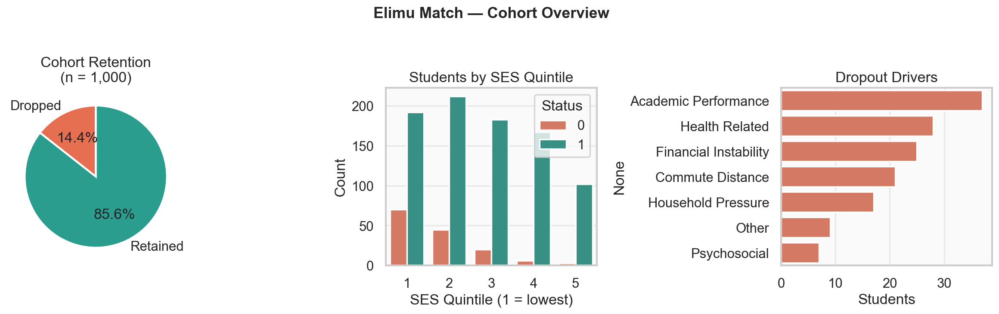

Live demos are at https://jesyldah.github.io/ElimuMatch/. The Helper portal is served as `sponsor_portal.html`; the Support Hub is `ops_dashboard.html`; analytics is `dashboard.html`; and schema documentation lives under `db/schema_dashboard.html`. Technology choices are intentionally modest and pilot-appropriate: Python for science and pipelines, SQLite for the fee books, static HTML for the product faces so a stakeholder can open the stack in any browser, and GitHub for reproducibility. Optional Streamlit work remains experimental; the primary share path is the HTML site.

Settlement policy is where architecture earns operational credibility. If a screen is stale because another gift just posted, the database rejects rather than creates unauthorized credit. If a helper enters more than remains on the selected terms, overpayment is blocked. Concurrent writes are locked. Those controls protect trust: strong models fail if money handling is weak.

What the proof of concept demonstrates is not national implementation. It demonstrates that risk-informed matching, ethical feature design, multi-layer data architecture, an end-to-end fee path, and operational governance hooks can coexist in a package an investor or partner can open today.

---

# 16. Cost Analysis

With the product path in place (Section 15), the open question for capital is economic: under what assumptions does an eight-school Year-1 pilot clear a positive case?

Reporting AUC alone is not a complete financial case. ElimuMatch’s Year-1 case is therefore told both as a transparent platform cost-benefit analysis (full assumption stack in `COST_BENEFIT_ANALYSIS.md`) and in Social Return language suited to CSR audiences, without presenting unaudited figures as audited P&L.

> **Integrity note.** Cost and benefit figures below are **illustrative** for a one-year pilot sized to the PoC cohort logic (~1,000 students / ~280 fee-support recommendations). They are not empirical results from a live Kenyan school system. The purpose is to show how ElimuMatch creates value and under what assumptions a pilot clears a positive case.

Value is framed along three lines. Economically, keeping a student in school protects human capital, which the case models with modest, explicit proxies rather than exaggerated lifetime-earnings claims. Operationally, better targeting means the same donor shillings do more retention-relevant work, and staff time is spent on ranked queues rather than ad hoc lists. Socially, explainable ranking is a fairness instrument relative to network-based awards.

### Capital requirements

| Source / use | Amount (KES) | Notes |
|---|---:|---|
| **Year-1 platform ask (setup + opex)** | **≈ 1,986,000** | MOU/ethics, platform hardening, school onboarding, part-time analyst and liaison, hosting, termly model refresh, contingency |
| **Pass-through helper gifts (not org revenue)** | Illustrative **4,000,000** | Fee gifts to school accounts; separate from platform budget |
| **Optional matched bursary pool** | Up to **2,000,000** | Only if funder seeds gifts; raises total spend, not org profit |
| **PoC development to date** | Founder time | Synthetic data, model, demos, and this brief (sunk development cost; not billed to the pilot) |

Funds raised for the pilot would deploy as: legal and school onboarding (≈ KES 570K combined setup lines), engineering hardening and payment integration (≈ KES 450K), operating staff and infrastructure (≈ KES 966K opex). No capital is assumed for national ministry integration or multi-channel marketplaces in Year 1.

### Summary of cost analysis

**Figure 21.** Illustrative Year-1 pilot platform cost versus base quantified benefit (bursaries pass through).

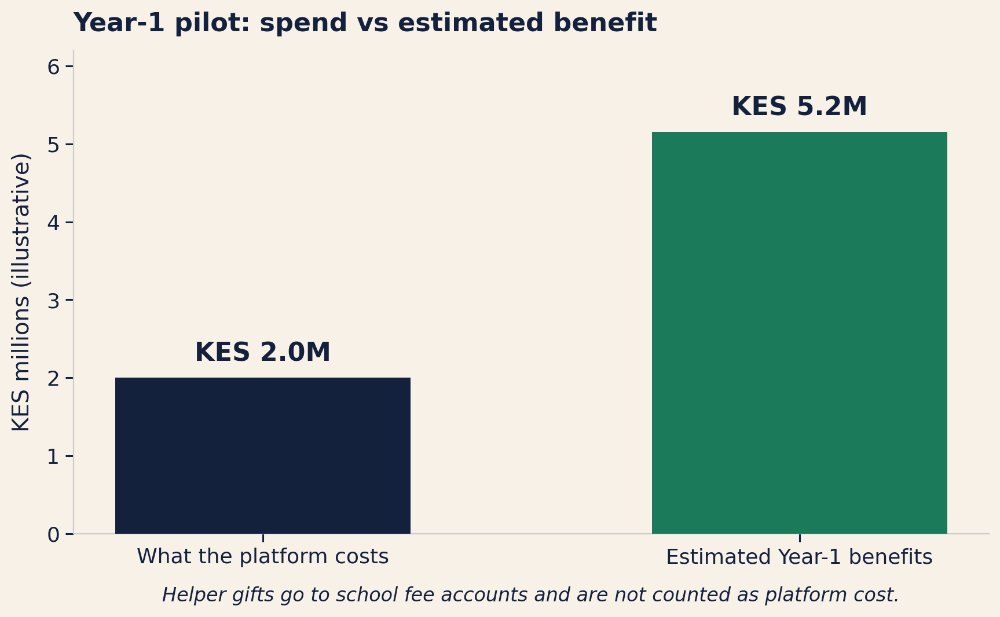

#### Year-1 pilot economics (self-contained base case)

**Pilot definition:** 8 partner secondary schools; ~800-1,000 students scored; fee-primary queue on the order of ~200-280 students; 12-month horizon; live payment rails replace simulated pay.

| Line | Base Year-1 (KES) | Notes |
|---|---:|---|
| Setup (MOU/ethics, platform harden, school onboarding) | 1,020,000 | Fixed / one-time |
| Operating (analyst, liaison, hosting, refresh, contingency) | 966,000 | Annualized |
| **Total platform cost (ex-bursary)** | **≈ 1,986,000** | Helper gifts are **not** org revenue or org opex |
| Targeting lift (same gift pool better allocated) | 1,000,000 | 25% of illustrative KES 4.0M gift volume |
| Avoided-dropout proxy (outcome benefit) | 4,000,000 | ~20 avoided dropouts × KES 200,000 Year-1 proxy |
| Ops productivity (ranked queue vs ad hoc) | 150,000 | ~0.25 FTE equivalent |
| **Quantified benefits (base)** | **≈ 5,150,000** | Excludes full pass-through value of clearing KES 4.0M fees |
| **Benefit-cost ratio (base)** | **≈ 2.6** | Conservative scenario near break-even; optimistic higher |

### Assumptions

Financial projections rest on explicit assumptions aligned with the eight-school pilot in `COST_BENEFIT_ANALYSIS.md`:

| Assumption | Base value | Rationale |
|---|---|---|
| Schools in pilot | 8 | Manageable ops; subset of 47-county design |
| Students scored | ~800-1,000 | Matches PoC cohort scale |
| Fee-primary queue | ~200-280 | PoC: 282 recommendations |
| Helper gift volume (pass-through) | KES 4,000,000 | Illustrative Year-1 helper/CSR inflow |
| Targeting lift (better allocation) | 25% of gift volume | Conservative vs “network giving” baseline |
| Students with meaningful fee support | 80 | Base case for outcome benefit |
| Share who would have dropped without support | 25% | Modest retention effect; not causal claim |
| Avoided dropouts (base) | ~20 | Derived from above |
| Value per avoided dropout (Year-1 proxy) | KES 200,000 | School fees retained + continuity; not lifetime-earnings net present value (NPV) |
| Platform cost | ≈ KES 2.0M | Setup + opex table in summary above |

Industry expectation for EdTech pilots is positive unit economics only after measured outcomes; this case therefore pairs financial assumptions with Section 9 operational KPIs rather than treating synthetic AUC as revenue proof.

### Return on investment (ROI) analysis

Return is expressed as benefit-cost ratio and simple payback on **platform cost only** (excluding pass-through bursaries).

| Metric | Base case | Conservative | Optimistic |
|---|---:|---:|---:|
| Platform cost (KES) | 2.0M | 2.0M | 2.0M |
| Quantified benefits (KES) | 5.15M | 1.8M | 10.8M |
| Net benefit (KES) | +3.2M | −0.2M | +8.8M |
| **Benefit-cost ratio** | **≈ 2.6×** | **≈ 0.9×** | **≈ 5.4×** |
| **Simple payback** | **< 12 months** | Not achieved on platform cost alone | **< 6 months** |

Payback interpretation: if base-case quantified benefits materialize within the first pilot year, platform spend is recovered within one academic cycle. Conservative case is intentionally near break-even to force governance discipline. Full ROI to society also includes pass-through fee clearance (KES 4.0M to schools), which is excluded from the organization’s BCR because it is not ElimuMatch profit.

### Risk and reward analysis

| Risk | Likelihood | Impact on return | Mitigation |
|---|---|---|---|
| Fewer avoided dropouts than modeled | Medium | Pulls case toward conservative / break-even | Measure next-term retention; gate scale on Section 9 |
| Weak helper conversion | Medium | Lowers gift volume and targeting lift | UX tested in PoC; marketing/partner channel in pilot |
| Settlement or data errors | Low-medium | Reputation loss; donor churn | Hard ledger rules; weekly integrity monitoring |
| Synthetic overconfidence | High in PoC | Misallocated capital if scaled too early | Retrain on partner data; soft pilot before publish |
| Subgroup fairness failure | Medium | Legal/reputational harm | Termly SES/gender fairness pack |

**Expected rate of return (base case):** approximately **160% net on platform cost** in Year 1 (net benefit ≈ KES 3.2M on ≈ KES 2.0M spend), with **moderate confidence** because outcome benefits depend on pilot measurement, not synthetic labels. **Reward upside** includes stronger donor efficiency, school fee recovery, and optional institutional contracts; **downside** is a break-even pilot that still produces audit-ready targeting and ledger discipline: an acceptable outcome if retention lift is smaller than hoped but process integrity holds.

### Scenario analysis (do not treat one number as truth)

All amounts are **estimates / assumptions**, not observed Kenyan cash flows. Platform cost is held near **KES 2.0M**. Benefits move with targeting lift and count of avoided dropouts (see `COST_BENEFIT_ANALYSIS.md`).

| Scenario | Quantified benefits (KES) | Platform cost (KES) | Net (KES) | BCR | What it assumes |
|---|---:|---:|---:|---:|---|
| **Conservative** | ≈ 1.8M | ≈ 2.0M | ≈ **−0.2M** | ≈ **0.9×** | Weaker targeting lift; ~8 avoided dropouts |
| **Base** | ≈ 5.15M | ≈ 2.0M | ≈ **+3.2M** | ≈ **2.6×** | 25% targeting lift; ~20 avoided dropouts |
| **Optimistic** | ≈ 10.8M | ≈ 2.0M | ≈ **+8.8M** | ≈ **5.4×** | Stronger lift; ~36 avoided dropouts |

*Reading.* The pilot is **not free-money guaranteed**. Under conservative outcomes it is roughly break-even on platform cost alone; under base assumptions it clears a healthy surplus. That is why Section 9 operational metrics - not synthetic AUC - are the go/no-go language for funders.

Pass-through fee clearance (the KES 4.0M of gifts themselves) benefits schools and households even while it never appears as ElimuMatch profit. Sensitivity is dominated by the **count of avoided dropouts**: modest undercounts bring the case near break-even, which is exactly why the pilot success metrics in Section 9 exist: capital should re-decide after measured outcomes, not synthetic model metrics alone.

The recommendation is therefore not “scale nationally tomorrow.” It is to fund an eight-school pilot near the platform cost above, measure fee-queue coverage, settlement integrity, scoring service levels, fairness cadence, and next-term retention, and only then decide how much of the product vision deserves further capital.

---

# 17. Recommendations

Evidence becomes **ordered actions** with owners and measures, plus explicit triggers that would reverse the recommendation. Capital unlocks the next gate only when the prior gate clears; that sequence is the road map in Figure 6 (Now → MOU gate → pilot → scale if earned).

### Prioritized recommendations (impact vs effort)

| Rank | Recommendation | Expected value | Feasibility | Urgency | Risk if skipped |
|---|---|---|---|---|---|
| **1** | Sign MOUs + DP/safeguarding before any live student data | Unlocks lawful pilot | High if schools engaged | Critical | Legal/ethical shutdown |
| **2** | Soft pilot: score + human review, **no public list** until quality gate | Protects dignity & trust | High on Tier-1 data | High | Stigma / bad first impression |
| **3** | Live fee lane with settlement hard rules + M-Pesa/bank rails | Donor conversion + school cash | Medium (payments integration) | High | Trust breaks permanently |
| **4** | Weekly/termly ops scorecard (Section 9 metrics) | Go/no-go discipline | High with clear role owners | High | Capital without learning |
| **5** | Termly model retrain + fairness pack | Durable ranking quality | Medium (0.4 FTE analyst) | Medium | Silent bias / drift |
| **6** | Expand schools / add one non-fee channel **only after gates** | Scale leverage | Low until pilot clears | Low until Year-1 | Premature scale, brand risk |

Impact rises on rows 1-4; effort spikes on payments and school onboarding - so the sequence is legal → soft pilot → live fee → measure → *then* expand.

### Recommendation logic chains

For each major recommendation: **evidence → insight → action → owner → expected impact → measurement**.

**R1 - Legal and ethical gate** 
- *Evidence:* Minors; no production authentication or data-protection rails in the PoC. 
- *Insight:* Capital without MOUs is not ambitious; it is reckless. 
- *Action:* Sign MOUs, data-protection clauses, and child-safeguarding agreements with eight schools. 
- *Owner:* Founder / MD + legal + school liaison. 
- *Expected impact:* Permission to use real extracts; funder confidence. 
- *Measure:* Eight signed packs before first MIS load (Phase 0).

**R2 - Soft pilot before public lists** 
- *Evidence:* Risk of optimistic synthetic performance; human review requirement. 
- *Insight:* Rankings can prioritize; they cannot replace review. 
- *Action:* Internal scoring only; case review of 100% of queue candidates before publish. 
- *Owner:* Ops case review + school liaison. 
- *Expected impact:* Fewer false priorities and dignity harms. 
- *Measure:* 100% review rate (Section 9); zero public publish of unreviewed IDs.

**R3 - Live fee gifts with settlement controls** 
- *Evidence:* Trust erodes on overpay or stale balances; the PoC proves the rules. 
- *Insight:* Machine learning without settlement is an incomplete product. 
- *Action:* Turn on payment rails; keep oldest-term-first, no overpay, and reject stale balances. 
- *Owner:* Finance ops + platform + payment vendor. 
- *Expected impact:* Clear term arrears for priority students; donor receipts. 
- *Measure:* 0 successful overpays; under 2% unresolved rejects; ≥40% queue coverage.

**R4 - Measure what synthetic data cannot prove** 
- *Evidence:* Avoided-dropout benefit dominates BCR sensitivity. 
- *Insight:* The financial case is a hypothesis until retention is observed. 
- *Action:* Termly scorecard and matched-peer retention report; restate BCR on real gifts. 
- *Owner:* Ops + analytics; board for go/no-go. 
- *Expected impact:* Evidence-based continue, redesign, or discontinue. 
- *Measure:* Section 9 dashboard complete each term; board gate after Year-1.

**R5 - Expand only after gates** 
- *Evidence:* Conservative BCR near break-even; multi-channel unfinished by design. 
- *Insight:* Breadth is a reward for integrity, not a launch-day promise. 
- *Action:* Add schools or one new helper channel only after KPI clear. 
- *Owner:* Funders + founder board. 
- *Expected impact:* Controlled scale without brand damage. 
- *Measure:* Explicit go/no-go memo against Section 9 targets.

### Roles and ownership (RACI-style: Responsible, Accountable, Consulted, Informed)

| Workstream | Accountable (A) | Responsible (R) | Consulted (C) | Informed (I) |
|---|---|---|---|---|
| School MOUs, DP & safeguarding | Founder / MD | Legal counsel + school liaison | School heads, boards | Funders, staff |
| MIS fee / grade / attendance extracts | School liaison lead | School data clerks | Analytics lead | Funders |
| Model rescoring & fairness pack | Analytics lead | Data/ML analyst (0.4 FTE) | Ops review | Leadership, funders |
| Human review of public queue | Ops case review (0.5 FTE) | School liaison | Analytics | Helpers (indirect) |
| Helper portal & settlement rules | Product / engineering | Platform contractor | Finance/ops | Funders |
| Payment rails (M-Pesa/bank to fees) | Finance ops | Payment vendor + platform | Schools, legal | Helpers |
| Pilot KPI dashboard & term report | Ops + analytics | Ops lead | Funders | Schools |
| Go / no-go on expansion | Funders + founder board | Founder | All leads | Public claims only after gate |

**Adoption / change management.** Schools will supply Tier-1 extracts and join case review; helpers keep using a **simple gift UI** (no training as data scientists); ops staff need training on the Support Hub, reject codes, and review protocol (school onboarding pack in setup budget). Process change is “ranked queue + human gate” replacing ad hoc lists - not a new theory of education.

### Implementation phases (practical roadmap)

| Phase | Timing | Outcomes | Resources (indicative) |
|---|---|---|---|
| **0. Gate legal** | Months 0-2 | Signed MOUs (8 schools); DP & safeguarding; ethics review complete | Legal/advisory within setup budget (~KES 250k line) |
| **1. Data & harden** | Months 1-4 | Tier-1 extracts live; platform auth/backup; payment stub→live path | Setup + contractor; school training line |
| **2. Soft pilot** | Term 1 | Internal scoring + human review only; no public student list until quality gate | Ops liaison + analyst |
| **3. Live fee gifts** | Terms 1-2 | Helpers gift live; settlement integrity tracked weekly; concentration alerts | Full opex footprint |
| **4. Measure** | End of year / each term | Scorecard vs Section 9 metrics; retention delta table; fairness pack | Analyst + ops termly refresh line |
| **5. Scale decision** | After Year-1 review | Expand schools / add one non-fee channel **only if** KPI gates clear | Separate capital ask |

### Monitoring after deployment

- **Weekly:** settlement rejects, gift concentration by school, broken balances 
- **Termly:** rescoring, fairness by SES/gender, fee-queue coverage, Term-1 ageing 
- **Annually:** full BCR restatement on *observed* (not synthetic) retention and gift volumes; board go/no-go 

Governance is part of product design: **data ownership** remains with schools under MOU; ElimuMatch processes extracts under purpose limitation (support allocation); **access** separates helper (anonymized gift UI), ops (queues, rejects), and analytics (full features/SHAP); **update cadence** is termly for models and live for fees; **escalation** if AUC by SES collapses, concentration spikes, or retention delta is non-positive for two terms is a board review (pause public lists; root-cause before more capital).

In the real world, synthetic CSVs become school extracts; simulated pay becomes mobile money or bank settlement to fee accounts; labels lag by term; scores drift and must be monitored; and public demo gifts that live offline become authenticated systems with privacy controls. This proof of concept is the rehearsal that makes those differences visible before money and reputations are on the line.

### What would change our mind

The pilot recommendation should be **revised or paused** if any of the following occur:

| Trigger | Revision |
|---|---|
| Partner holdout **dropout recall falls below ~0.40** after retrain on real admin fields with honest labeling | Replace or re-threshold model before public gift lists; do not claim PoC AUC ports |
| Fairness review shows **systematic under-ranking of a protected group** that human review cannot correct | Pause auto-publish; redesign features / review policy with schools |
| Settlement reject rate stays **above ~10%** after helper UX fixes | Fix ledger/UX before scaling helpers; capital may still fund integrity work |
| **Next-term retention** for helped students is **no better** (and not explained by selection bias) for two terms | Pivot the theory of change (for example, more health or tutoring capacity) or discontinue fee-lane expansion |
| Schools **cannot** deliver Tier-1 extracts on time for two consecutive terms | Shrink pilot or move to thinner campus footprint; do not assume the platform alone resolves data gaps |
| Conservative financial restatement on *observed* gifts still yields **net less than zero for two years** with high process integrity | Reassess platform cost structure or wind down the program - mission is impact per shilling spent |

**Investment ask (pilot stage):** approve Year-1 platform operations for an eight-school pilot (**≈ KES 2.0M** platform cost, excluding pass-through bursaries); fund the roles above (part-time analytics and school liaison); unlock partner data under MOU; run the fee channel live with human review; and open a program-scale decision **only after** the Section 9 pilot scorecard clears, and only while the triggers above remain quiet.

---

# 18. Founder's Note

ElimuMatch was built by me, Jesyldah. I care about giving back, but the practical path is hard. Finding the right student, sustaining support term after term, and staying connected when I live in the city and rarely return to the village are all difficult. Many organizations focus their help on arid and semi-arid areas. I still want to support children from my home area, and I know students drop out across Kenya, not only in those regions. From the city, that usually means finding someone on the ground to visit schools, speak with teachers, identify students, and send records back. What I want is simpler. That is the problem ElimuMatch starts with: make it easy to find a school and a student, give toward fees, and return whenever I am ready to help again.

Along the way I learned that analytics only matter when a clear audience can use them. Early on I tried to cover too many needs at once. The turning point was choosing one audience and one kind of help, then building around that. Choosing secondary school rather than primary was part of that decision. I see secondary as a pivotal stage: if a student can stay and finish there, more doors stay open. That choice still has a cost. It leaves out learners who never reach secondary, and children still in primary who may leave for the same reasons of fees, health, and access. Accepting that limit made it possible to finish one complete path: a way for someone like me to give toward school fees, while relying on schools and partners for tutoring, health, and other support.

Next, I would spend more time earlier on research and real school data, working with people and organizations that already hold those records. The data used here is synthetic and documented for this build, not a substitute for that partnership. I would also test sooner whether people like me actually use this kind of giving path in practice, and whether it holds up beyond this first working version. Drafting of this brief was supported with Cursor Auto (Composer) assistance (Cursor, 2026); analytics design, product decisions, and all claims remain the author’s responsibility.

---

# 19. References

Adhola, F., Ochola, J., & Tikoko, B. (2025). Relationship between donor funding and school operations in public secondary schools in Nakuru County, Kenya. *Edition Consortium Journal of Curriculum and Educational Studies, 7*(1), 1-15.

Adelman, C. (2006). *The toolbox revisited: Paths to degree completion from high school through college.* U.S. Department of Education.

Basch, C. E. (2011). Healthier students are better learners: A missing link in school reforms to close the achievement gap. *Journal of School Health, 81*(10), 593-598. https://doi.org/10.1111/j.1746-1561.2011.00632.x

Childress, M. (2015). *Dynamics of education in Kenya: From school access to equity and quality.* The School Fund. Kenya Education Resources Database, University of Nairobi. https://kerd.ku.ac.ke/handle/123456789/1577

Cortez, P., & Silva, A. M. G. (2008). Using data mining to predict secondary school student performance. In A. Brito & J. Teixeira (Eds.), *Proceedings of 5th Annual Future Business Technology Conference* (pp. 5-12). EUROSIS.

Cursor. (2026). *Auto (Composer)* drafting assistance for the ElimuMatch investor brief [Large language model]. https://cursor.com/

Glennerster, R., Kremer, M., Mbiti, I., & Takavarasha, K. (2011). *Access and quality in the Kenyan education system: A review of the progress, challenges and potential solutions.* Prepared for the Office of the Prime Minister of Kenya. Abdul Latif Jameel Poverty Action Lab and Innovations for Poverty Action. https://www.povertyactionlab.org/sites/default/files/research-paper/Access%20and%20Quality%20in%20the%20Kenyan%20Education%20System%202011.06.22.pdf

Gongera, E., & Okoth, N. O. (2013). Alternative sources of financing secondary school education in the rural counties of Kenya: A case study of Kisii County, Kenya. *Journal of Education and Practice, 4*(17), 78-85.

Jesyldah. (2026). *ElimuMatch* repository and Pages demo. https://github.com/Jesyldah/ElimuMatch ; https://jesyldah.github.io/ElimuMatch/

Kenya National Bureau of Statistics (KNBS). (2025). *Economic Survey 2025* (Popular Version). https://www.knbs.or.ke/

Kenya National Bureau of Statistics / Kenya Data Portal. (n.d.). Kenya Open Data resources. https://kenya.opendataforafrica.org/

Lundberg, S. M., & Lee, S.-I. (2017). A unified approach to interpreting model predictions. In I. Guyon et al. (Eds.), *Advances in Neural Information Processing Systems* (Vol. 30), 4765-4774. Curran Associates.

Otieno, M. A., & Ochieng, J. A. (2020). Impact of 100 per cent transition policy on public secondary schools in Machakos Sub-County, Kenya: Focusing on coping strategies. *Journal of Education and Practice, 11*(24), 69-77. https://doi.org/10.7176/JEP/11-24-08

Realinho, V., Machado, J., Baptista, L., & Martins, M. V. (2022). Predicting student dropout and academic success. *Data, 7*(11), 146. https://doi.org/10.3390/data7110146

RELI Africa. (2020). *Study on the status of secondary education in Kenya* (abridged version). Regional Education Learning Initiative. https://reliafrica.org/wp-content/uploads/2024/02/Status-of-Secondary-School-Education-Abridged-Version-2020.pdf

Tinto, V. (1993). *Leaving college: Rethinking the causes and cures of student attrition* (2nd ed.). University of Chicago Press.

UNESCO International Institute for Capacity Building in Africa (IICBA). (2025). *Kenya education data brief* (Data Brief 2025-20). https://www.iicba.unesco.org/

---

# 20. Appendix

The appendix holds denser detail: links, figure paths, snapshots, and decisions that would slow the main narrative.

## A. Key links and internal documents

The live demos open at https://jesyldah.github.io/ElimuMatch/ (Jesyldah, 2026). Source code is at https://github.com/Jesyldah/ElimuMatch. Full data and limitation prose is in `DATA_AND_LIMITATIONS.md`. Cost-benefit tables are expanded in `COST_BENEFIT_ANALYSIS.md`. Schema browsing is available via `db/schema_dashboard.html`. Modeling and SHAP write-ups sit under `modeling_outputs/` and `shap_outputs/`.

## B. Figure index (report narrative)

| Fig. | Subject | Path |
|---|---|---|
| 1-2 | **External grounding** (completion funnel; secondary enrolment 2020-2024) | `report_figures/ext_02_*.png`, `ext_03_*.png` |
| 3 | Product layers (helper / ops / analytics) | `report_figures/01_product_layers.png` |
| 3b | Day in the life of one fee gift | `report_figures/10_gift_journey.png` |
| 4 | Perceptual map (substitutes) | `report_figures/09_perceptual_map.png` |
| 5 | Matching loop (score → gift → monitor) | `report_figures/02_matching_loop.png` |
| 6 | Pilot roadmap / scale gates | `report_figures/07_pilot_roadmap.png` |
| 7-10 | Preparation & EDA charts | `visualizations/05`, `02`, `06`, `04` |
| 11-14 | Model selection & fairness | `report_figures/08`, `visualizations/25`, `21`, `24` |
| 15-16 | SHAP | `visualizations/31`, `32` |
| 17-19 | Personas & interventions | `visualizations/17`, `38`, `19` |
| 20 | Cohort overview | `visualizations/01` |
| 21 | Year-1 economics | `report_figures/06_year1_economics.png` |

*Strategy diagrams use a simple format for clarity. Data charts remain pipeline-generated. Additional technical charts live in `visualizations/` if denser appendices are required.*

## C. Predictive feature families and dictionary snapshot

Feature families used for ranking: demographic and fairness (age at enrolment, gender); household and economic (resource dilution, SES, cash-flow volatility); access (commute barriers, digital equity, nutritional support); academic momentum (GPA trend, failed subjects, STEM strength); health and attendance (chronic health risk, health-related absences); belonging and protection (social integration, psychosocial support access). Layer 2 helper filters operate at county and school level. Layer 3 ledger fields stay outside training.

**Snapshot location in narrative:** Section 11 table “Data dictionary snapshot” (layer, model inclusion, pilot tier, exclusions). Full dictionary source files: `Data dic.docx`, `tableau_exports/data_dictionary.csv`, and `db/schema_dashboard.html`.

## D. Modeling snapshot

Selected model: Logistic Regression with `C = 0.1`. Approximate test AUC 0.753. Approximate dropout recall 0.667. Majority baseline AUC 0.50. Full leaderboard: `modeling_outputs/MODELING_REPORT.md`.

## E. Cost-benefit snapshot

Illustrative Year-1 platform cost near KES 2.0 million. Base quantified benefits near KES 5.2 million. Base benefit-cost ratio near 2.6. Conservative case near break-even. Full assumption tables in `COST_BENEFIT_ANALYSIS.md`.

## F. Reproduction note

To rebuild models and product surfaces from the repository, install `requirements.txt` and run the pipeline scripts documented in the project README (`preprocess_data.py`, `modeling_phase.py`, SHAP/persona/intervention builders, and `build_sponsor_portal.py` / `build_ops_dashboard.py` / `build_dashboard.py`). Local live gifts: `OPEN_DEMO.bat` or `python db/portal_server.py --open`.

## G. Suggested ten-minute investor pitch arc

**Context (outside the clock):** pitch to impact / education investors and CSR or foundation partners, seeking pilot capital for an eight-school launch.  
**On the clock:** open with Kenya’s equity and retention problem and **Figures 1-2** (sector grounding); **Figure 3** (product layers) and **Figure 4** (substitutes map). Open the Pages homepage and walk one helper gift (Day and Boarding). Show ops on settlement integrity and one pilot KPI. Flash **Figure 11** (why Logistic Regression) and **Figure 15** (SHAP). Close with **Figure 21** (cost) and **Figure 6** (gates) and the pilot ask.

## H. Decision log (significant choices)

| Decision | Alternatives considered | Justification | Consequence |
|---|---|---|---|
| **Synthetic cohort (seed 2026)** | Wait for school microdata | Privacy, MOU lag, and need for a buildable PoC | All metrics are non-portable until partner validation |
| **Fee channel only for helper MVP** | Four helper marketplaces at once | Finish one end-to-end path with settlement integrity | Tutoring/health/digital stay ops/school design |
| **Exclude orphan status as feature** | Use as “need” proxy | Bias and dignity risk | SES / behavioral proxies carry need signal |
| **Keep fee arrears out of training matrix** | Predict dropout from balances only | Avoid “owe money → drop” shallow story; protect ledger role | Ranking from Layer 1 risk; money is Layer 3 ops |
| **Select Logistic Regression** | Random Forest / HistGradientBoosting with higher or similar AUC | Business rule: dropout recall when AUC within ~0.015 | Lower headline accuracy; higher detection of leavers |
| **HTML + GitHub Pages as primary share** | Streamlit-only / zip install | Accessibility for investors/partners; no local installation required | Offline gifts on Pages; live ledger is local option |
| **Pass-through gifts (not org revenue)** | Take cut of gifts as revenue | Trust and school relationship | Business case uses platform cost, not gift P&L |
| **8-school pilot before national scale** | National launch narrative | Scope discipline; measurable gates | Catalog is national; volume is pilot |

## I. Figures and sources note

**External grounding (Figures 1-2):** (1) UNESCO IICBA (2025) completion funnel estimates; (2) KNBS (2025) *Economic Survey* secondary enrolment **2020-2024** (no full-year **2025** national total in that release). Captions state sector context only - not ElimuMatch performance.

**Internal evidence:** Charts in `visualizations/` are generated from the project pipeline on the synthetic cohort. Conceptual / strategy graphics in `report_figures/` (product layers, gift journey, matching loop, roadmap, perceptual map, selection rule, Year-1 economics) use the simple original report style. Live product UI: https://jesyldah.github.io/ElimuMatch/ (Jesyldah, 2026). Full financial assumptions: `COST_BENEFIT_ANALYSIS.md`.

Every parenthetical or narrative citation in the main report maps to Section 19. Figure captions and this appendix note carry source notes for charts.