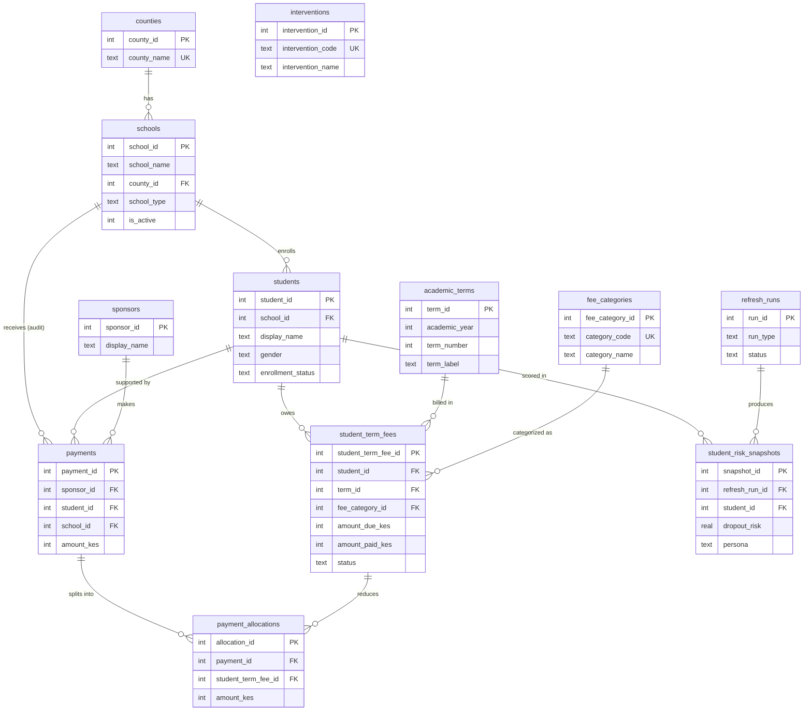

# Elimu Match — Database Schema Documentation

**DBMS:** SQLite (PoC) → Postgres-ready logical model  
**File:** `db/elimu_match.db`  
**DDL:** [`ddl.sql`](ddl.sql) · also embedded in [`schema.py`](schema.py)  
**Rebuild:** `python db/init_db.py`

This document is the **schema documentation** package for the report appendix:

| Artifact | Purpose |
|---|---|
| **ERD** (Entity-Relationship Diagram) | Visual links between tables |
| **Relationship map** | FK cardinality in words |
| **Data dictionary** | Column-level definitions |
| **DDL** | `CREATE TABLE` statements |
| **Views** | Reporting / portal read models |

---

## 1. Entity-Relationship Diagram (ERD)



---

## 2. Relationship map (links)

| From | To | Cardinality | FK | Notes |
|---|---|---|---|---|
| `schools` | `counties` | N : 1 | `schools.county_id` | School belongs to one county |
| `students` | `schools` | N : 1 | `students.school_id` | Current enrollment school |
| `student_term_fees` | `students` | N : 1 | `student_id` | One row per student × term × category |
| `student_term_fees` | `academic_terms` | N : 1 | `term_id` | Term arrears grain |
| `student_term_fees` | `fee_categories` | N : 1 | `fee_category_id` | Tuition / boarding / lunch / activity |
| `student_risk_snapshots` | `students` | N : 1 | `student_id` | Many scores over time |
| `student_risk_snapshots` | `refresh_runs` | N : 1 | `refresh_run_id` | Batch that produced the scores |
| `payments` | `sponsors` | N : 1 | `sponsor_id` | Nullable for anonymous PoC |
| `payments` | `students` | N : 1 | `student_id` | Who was supported |
| `payments` | `schools` | N : 1 | `school_id` | **Denormalized audit** — school at pay time |
| `payment_allocations` | `payments` | N : 1 | `payment_id` | Partial pay splits |
| `payment_allocations` | `student_term_fees` | N : 1 | `student_term_fee_id` | Which arrears line was reduced |

**Logical (soft) link:** `student_risk_snapshots.primary_intervention_code` ↔ `interventions.intervention_code` (not enforced FK in PoC).

**Grain that enables partial pay + term arrears:**  
`student_term_fees` UNIQUE `(student_id, term_id, fee_category_id)`.

---

## 3. Data dictionary

### 3.1 `counties`

| Column | Type | Null | Key | Description |
|---|---|---|---|---|
| `county_id` | INTEGER | N | PK | Surrogate key |
| `county_name` | TEXT | N | UK | County name (e.g. Busia) |

**Availability:** High — public geography.

### 3.2 `schools`

| Column | Type | Null | Key | Description |
|---|---|---|---|---|
| `school_id` | INTEGER | N | PK | School identifier |
| `school_name` | TEXT | N | | Display name |
| `county_id` | INTEGER | N | FK → counties | Location |
| `school_type` | TEXT | N | | `Day` or `Boarding` |
| `is_active` | INTEGER | N | | 1 = active in portal |

**Availability:** High — partner school list / MoE directories.

### 3.3 `academic_terms`

| Column | Type | Null | Key | Description |
|---|---|---|---|---|
| `term_id` | INTEGER | N | PK | Surrogate key |
| `academic_year` | INTEGER | N | UK* | Calendar/academic year |
| `term_number` | INTEGER | N | UK* | 1, 2, or 3 |
| `term_label` | TEXT | N | | Display label, e.g. `2026 Term 2` |
| `start_date` | TEXT | Y | | Term start (ISO date string) |
| `due_date` | TEXT | Y | | Fee due date |

\* UNIQUE `(academic_year, term_number)`

**Availability:** High — school calendar.

### 3.4 `fee_categories`

| Column | Type | Null | Key | Description |
|---|---|---|---|---|
| `fee_category_id` | INTEGER | N | PK | Surrogate key |
| `category_code` | TEXT | N | UK | `tuition`, `boarding`, `lunch`, `activity`, `other` |
| `category_name` | TEXT | N | | Human-readable label |

**Availability:** Medium–high — some schools only track a single “fees owed” total (map to one category).

### 3.5 `interventions`

| Column | Type | Null | Key | Description |
|---|---|---|---|---|
| `intervention_id` | INTEGER | N | PK | Surrogate key |
| `intervention_code` | TEXT | N | UK | Code used by intervention matrix |
| `intervention_name` | TEXT | N | | Display name |
| `unit_cost_kes` | INTEGER | Y | | Indicative unit cost |
| `owner` | TEXT | Y | | School / Elimu Match / sponsor |

**Availability:** Internal Elimu Match config (not school-sourced).

### 3.6 `students`

| Column | Type | Null | Key | Description |
|---|---|---|---|---|
| `student_id` | INTEGER | N | PK | Anonymized student ID |
| `school_id` | INTEGER | N | FK → schools | Current school |
| `display_name` | TEXT | N | | Sponsor-facing label (e.g. `Student #22`) |
| `age_at_enrollment` | INTEGER | Y | | Age |
| `gender` | TEXT | Y | | `Boy` / `Girl` / `Other` / `Unknown` |
| `enrollment_status` | TEXT | N | | `enrolled` / `dropped` / `transferred` / `graduated` |
| `created_at` | TEXT | N | | Row created |
| `updated_at` | TEXT | N | | Last update |

**Availability:** High for MVP (admin register). No PII beyond anonymized display name in PoC.

### 3.7 `refresh_runs`

| Column | Type | Null | Key | Description |
|---|---|---|---|---|
| `run_id` | INTEGER | N | PK | Batch ID |
| `run_type` | TEXT | N | | `fee_sync` / `risk_rescore` / `payment_import` / `full_rescore` |
| `source` | TEXT | Y | | `csv`, `api`, `manual`, script name |
| `started_at` | TEXT | N | | Start timestamp |
| `finished_at` | TEXT | Y | | End timestamp |
| `status` | TEXT | N | | `running` / `success` / `failed` |
| `notes` | TEXT | Y | | Free text |

**Availability:** System-generated (ops metadata).

### 3.8 `student_risk_snapshots`

| Column | Type | Null | Key | Description |
|---|---|---|---|---|
| `snapshot_id` | INTEGER | N | PK | Surrogate key |
| `refresh_run_id` | INTEGER | N | FK → refresh_runs | Scoring batch |
| `student_id` | INTEGER | N | FK → students | Student |
| `ses_quintile` | INTEGER | Y | | 1–5 SES band (if available) |
| `dropout_risk` | REAL | Y | | Model P(dropout) or risk score |
| `persona` | TEXT | Y | | Cluster persona label |
| `retained_flag` | INTEGER | Y | | Historical outcome 0/1 if known |
| `primary_intervention_code` | TEXT | Y | | Soft link → interventions |
| `scored_at` | TEXT | N | | Score timestamp |

UNIQUE `(refresh_run_id, student_id)`

**Availability:** Derived from the analytics pipeline — **not** typed by school clerks. Raw survey features stay outside this DB.

### 3.9 `student_term_fees` *(core fee ledger)*

| Column | Type | Null | Key | Description |
|---|---|---|---|---|
| `student_term_fee_id` | INTEGER | N | PK | Surrogate key |
| `student_id` | INTEGER | N | FK → students | Student |
| `term_id` | INTEGER | N | FK → academic_terms | Billing term |
| `fee_category_id` | INTEGER | N | FK → fee_categories | Fee type |
| `amount_due_kes` | INTEGER | N | | Amount billed (KES) |
| `amount_paid_kes` | INTEGER | N | | Cumulative paid (KES); supports **partial** pay |
| `status` | TEXT | N | | `unpaid` / `partial` / `paid` / `waived` |
| `updated_at` | TEXT | N | | Last balance change |

UNIQUE `(student_id, term_id, fee_category_id)` · CHECK `amount_paid_kes <= amount_due_kes`

**Availability:** High for Phase 1 if bursar keeps balances; even a single “balance owed” maps to one category × terms.

### 3.10 `sponsors`

| Column | Type | Null | Key | Description |
|---|---|---|---|---|
| `sponsor_id` | INTEGER | N | PK | Surrogate key |
| `display_name` | TEXT | N | | Name or `Anonymous Sponsor` |
| `email` | TEXT | Y | | Optional contact |
| `created_at` | TEXT | N | | Created |

**Availability:** Created at payment time (PoC has no login).

### 3.11 `payments`

| Column | Type | Null | Key | Description |
|---|---|---|---|---|
| `payment_id` | INTEGER | N | PK | Surrogate key |
| `sponsor_id` | INTEGER | Y | FK → sponsors | Who paid |
| `student_id` | INTEGER | N | FK → students | Beneficiary |
| `school_id` | INTEGER | N | FK → schools | School at time of payment (audit) |
| `amount_kes` | INTEGER | N | | Gross payment (KES); may be **partial** vs total arrears |
| `currency` | TEXT | N | | Default `KES` |
| `payment_method` | TEXT | N | | `simulated` / `mpesa` / `card` / `bank` / `cash` |
| `status` | TEXT | N | | `pending` / `completed` / `failed` / `refunded` |
| `paid_at` | TEXT | N | | Payment timestamp |
| `external_ref` | TEXT | Y | | M-Pesa receipt / bank ref |
| `notes` | TEXT | Y | | Free text |

**Availability:** System-generated on gift; real M-Pesa is Phase 2+.

### 3.12 `payment_allocations`

| Column | Type | Null | Key | Description |
|---|---|---|---|---|
| `allocation_id` | INTEGER | N | PK | Surrogate key |
| `payment_id` | INTEGER | N | FK → payments | Parent payment |
| `student_term_fee_id` | INTEGER | N | FK → student_term_fees | Arrears line credited |
| `amount_kes` | INTEGER | N | | Portion of payment applied to this line |
| `allocated_at` | TEXT | N | | Allocation timestamp |

**Availability:** System-generated. Default policy: oldest term first; within term tuition → boarding → lunch → activity.

---

## 4. Views (read models — not base tables)

| View | Purpose |
|---|---|
| `v_term_arrears` | Outstanding lines by student / term / category |
| `v_student_fee_summary` | Per-student totals + term1/2/3 arrears |
| `v_payment_detail` | Payment → allocation audit trail |
| `v_sponsor_fee_candidates` | Portal feed: students with arrears + **latest scoring** risk snapshot (`MAX(refresh_run_id)` from `student_risk_snapshots`, not payment imports) |

View SQL lives in [`schema.py`](schema.py) (`SCHEMA_SQL`).

---

## 5. Normalization notes (for report)

- Base tables target **~3NF**: dimensions separated; fee fact grain is student × term × category; payments split from allocations.
- **Views** are intentionally denormalized for ops/sponsor reads.
- **`payments.school_id`** is intentional denormalization for historical audit if a student transfers.
- Full modeling feature set (37 columns) is **not** stored here — only scored snapshots + fee ops data (availability-aware MVP).

---

## 6. How to recreate

```bash
# Preferred (seeds synthetic data + demo payment)
python db/init_db.py

# DDL only (empty structure)
sqlite3 db/elimu_match.db < db/ddl.sql
```

Example queries:

```sql
-- Term arrears for one student
SELECT * FROM v_term_arrears WHERE student_id = 22;

-- Fee summary with term columns
SELECT * FROM v_student_fee_summary WHERE student_id = 22;

-- Sponsor candidates
SELECT * FROM v_sponsor_fee_candidates ORDER BY dropout_risk DESC LIMIT 20;
```
